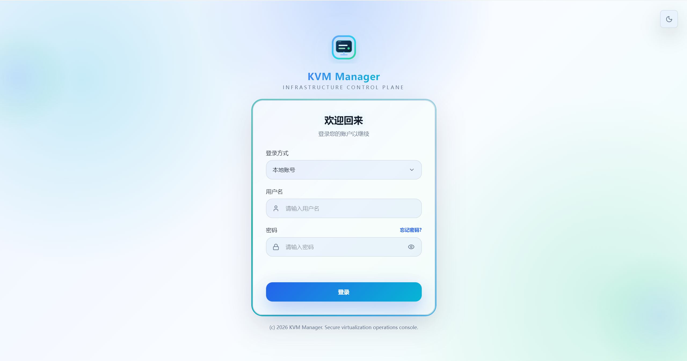
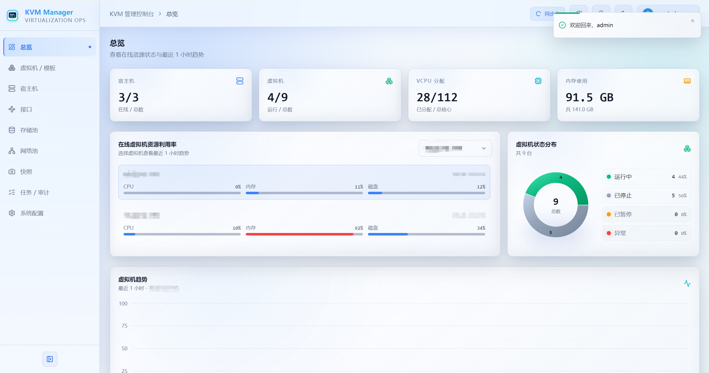

# KVM Manager

KVM Manager 是一个面向 KVM/libvirt 环境的虚拟化资源管理控制台，包含 React 前端、Go 后端、PostgreSQL 数据库以及部署在宿主机上的 KVM Agent。

## 目录

- [一、项目介绍](#一项目介绍)
- [二、本地开发快速启动](#二本地开发快速启动)
- [三、Docker Compose 快速部署](#三docker-compose-快速部署)
- [四、生产环境部署](#四生产环境部署)
- [五、使用说明](#五使用说明)
- [六、安全说明](#六安全说明)
- [七、注意事项](#七注意事项)
- [八、常见问题](#八常见问题)
- [九、API 文档](#九api-文档)
- [十、版本历史](#十版本历史)
- [十一、许可证](#十一许可证)
- [十二、致谢](#十二致谢)
- [十三、联系方式](#十三联系方式)

# 一、项目介绍

## 1.1 项目简介

KVM Manager 是一个面向多宿主机 KVM/libvirt 环境的虚拟化资源管理平台，用于把分散在不同宿主机上的虚拟机、存储池、网络池、快照、运行态指标和运维操作集中到同一个控制台中管理。平台采用控制中心与宿主机 Agent 分离的架构：控制中心负责用户认证、权限、Agent 登记、运行态缓存、异步任务、审计日志、告警通知和系统配置；KVM Agent 部署在每台宿主机上，负责执行受控的 libvirt、virsh、virt-df、qemu-img 等本机采集与操作命令。

项目不把宿主机、虚拟机和快照作为长期主数据写入 PostgreSQL，而是通过 Agent 按需采集，并将运行态优先维护在 Redis 缓存中。PostgreSQL 主要保存平台自身数据，例如用户、角色权限、会话、Agent 登记、任务、审计日志、告警、通知媒介、系统配置、指标样本和平台侧备注等。这样可以降低资源状态与真实 KVM 环境不一致的风险，也便于在 Agent 或缓存异常后重新从宿主机恢复运行态视图。

平台面向日常虚拟化运维场景，覆盖宿主机资源观测、虚拟机创建与生命周期操作、在线扩容、迁移、克隆、快照、存储池、网络池、宿主机接口、运行态刷新、趋势指标、告警通知、操作审计和 RBAC 权限控制。前端提供深色 / 浅色主题、统一任务反馈、SSE 实时刷新、导出能力和系统配置页面；后端通过异步任务和审计链路把高风险操作、后台刷新和告警恢复过程串联起来，便于排查和追溯。

## 1.2 项目预览

|                   项目登录页                   |
| :--------------------------------------------: |
|  |

|                   项目首页                   |
| :------------------------------------------: |
|  |


## 1.3 核心功能

- **用户认证**：管理员初始化、JWT 会话、登录状态校验、修改密码与注销。
- **Agent 管理**：登记、删除、连接测试、手动同步 KVM Agent。
- **宿主机监控**：从 Agent 获取 CPU、内存、存储、负载等宿主机运行态信息，并支持单宿主机趋势查看。
- **虚拟机管理**：查看虚拟机列表和详情，支持启动、关机、重启等基础操作，并提供单 VM 监控窗口；编辑资源时可配置内存统计周期。
- **在线扩容**：已运行虚拟机支持在预留上限内热扩容当前 CPU、当前内存和已有磁盘容量。
- **快照管理**：从 Agent 实时获取虚拟机快照列表，支持创建、恢复、删除快照，并在平台侧维护备注和标签。
- **实时刷新**：后端按环境变量定时触发全局运行态轻量刷新任务，前端通过 SSE 事件更新页面，手动刷新接口仍可触发 full 全量任务。
- **离线告警**：连续同步失败达到阈值后标记 Agent 离线并生成活跃告警，同步恢复后自动恢复。
- **系统配置**：提供告警通知媒介与认证配置，支持 Webhook、邮件、飞书/企业微信/钉钉机器人、飞书/企业微信/钉钉应用通知和 AD/LDAP。
- **任务与审计**：记录后台刷新任务、虚拟机操作任务、关键审计日志和平台告警，并提供统一运维页面查看。

## 1.4 实时数据边界

数据库保存项目自身数据，包括用户、会话、Agent 登记、Agent 运行状态、任务、审计日志和告警。

数据库不创建也不维护宿主机、虚拟机、快照资源表。此类数据可由 Agent 随时重新获取，后端统一在 Redis 中维护运行态缓存，并通过 API 与 SSE 提供给前端展示。Redis 是必需依赖，后端启动时会校验连接，连接失败则服务启动失败。

## 1.5 专题文档索引

README 主要覆盖安装部署、常用操作和接口概览；更细的采集口径、刷新边界、操作日志覆盖和前端控件规范放在 `docs/` 目录：

| 文档 | 适用场景 |
| :-: | :-: |
| [docs/frontend-refresh-functions.md](docs/frontend-refresh-functions.md) | 查看自动刷新、手动刷新、SSE 事件、fast/full 边界和各页面刷新入口 |
| [docs/vm-info-collection.md](docs/vm-info-collection.md) | 查看虚拟机字段来源、采集命令、CPU/内存/磁盘/I/O 计算口径和回退策略 |
| [docs/host-info-collection.md](docs/host-info-collection.md) | 查看宿主机字段来源、资源使用率、宿主机趋势和接口采集链路 |
| [docs/operation-log-coverage.md](docs/operation-log-coverage.md) | 查看任务、审计日志、告警、通知投递记录的覆盖范围和失败记录边界 |
| [docs/agent-command-timeout-and-temp-dirs.md](docs/agent-command-timeout-and-temp-dirs.md) | 排查 Agent 命令超时、`COMMAND_TIMEOUT_SECONDS` 作用范围和 `/tmp` 临时目录来源 |
| [docs/network-interface-dns-bridge-implementation.md](docs/network-interface-dns-bridge-implementation.md) | 查看宿主机接口 DNS 写入、NAT/ROUTE/BRIDGE 网络池校验和桥接能力边界 |
| [docs/frontend-select-dropdown-placement.md](docs/frontend-select-dropdown-placement.md) | 查看前端 Select/listbox 下拉展开方向、弹窗内下拉遮挡和控件维护规范 |

## 1.6 技术栈

### 1.6.1 后端

- **语言**：Go 1.25+
- **HTTP**：Go 标准库 `net/http` 路由
- **数据库**：PostgreSQL
- **数据库驱动**：pgxpool
- **配置加载**：godotenv
- **认证**：JWT 风格会话 Token + PostgreSQL Session
- **密码/令牌安全**：bcrypt、SHA-256、AES-GCM
- **实时能力**：后端定时刷新任务、Redis 运行态缓存、SSE 事件流

### 1.6.2 前端

- **框架**：React 19
- **构建工具**：Vite 7
- **语言**：TypeScript
- **路由**：React Router 7
- **样式**：Tailwind CSS 4
- **图标**：lucide-react
- **图表**：recharts
- **通知**：sonner

### 1.6.3 Agent

- **语言**：Go 1.25+
- **运行环境**：Linux KVM 宿主机
- **虚拟化接口**：libvirt / virsh
- **安全机制**：Bearer Token，可选 TLS

## 1.7 项目结构

```text
kvm-manager/
├── agent/                         # 部署在 KVM 宿主机上的 Agent
│   ├── api/
│   │   └── router/                 # Agent HTTP 路由、处理函数和控制台代理
│   ├── cmd/agent/                  # Agent 启动入口
│   ├── config/                     # Agent 环境变量配置加载
│   └── internal/                   # Agent 内部 KVM 操作与鉴权能力
│       ├── kvm/                    # virsh 采集、接口、控制台、动作、热扩容、介质、解析、克隆与存储池校验等实现
│       └── security/               # Agent Bearer Token 鉴权
├── backend/                        # Go 后端控制中心
│   ├── api/
│   │   └── router/                 # HTTP API 路由、处理函数、中间件、Swagger 注解与文档模型
│   ├── cmd/server/                 # 后端启动入口
│   ├── config/                     # 后端环境变量配置加载
│   ├── docs/                       # 后端 Swagger/OpenAPI 生成文件
│   ├── internal/                   # 后端内部领域、仓储和业务服务
│   │   ├── domain/                 # 后端领域模型
│   │   ├── repository/             # PostgreSQL 仓储
│   │   └── service/                # 用户认证、通知和实时同步等业务服务
│   └── pkg/                        # 后端基础设施与可复用能力
│       ├── agent/                  # 访问 KVM Agent 的客户端与 VM 相关请求模型
│       ├── database/               # PostgreSQL 连接与初始化迁移
│       └── tokencrypto/            # Agent Token 加密存储
├── deploy/                         # Docker Compose、Nginx、Supervisor 和容器入口配置
├── docs/                           # 项目设计、采集说明、网络配置实施记录与前端控件行为文档
├── frontend/                       # React 前端应用
│   ├── public/                     # 静态资源
│   └── src/
│       ├── main.tsx                # React 应用挂载入口
│       ├── index.css               # 全局样式与主题变量
│       ├── App.css                 # 应用级样式补充
│       ├── vite-env.d.ts           # Vite 类型声明
│       ├── app/                    # 应用入口组件
│       │   └── App.tsx             # 全局路由、认证态与页面装配
│       ├── components/             # 跨业务域复用组件
│       │   ├── boot/               # 启动加载页组件
│       │   ├── kvm/                # KVM 状态徽标、趋势图、统一下拉、指标轴、弹窗 Portal 与宿主机趋势弹窗
│       │   └── layout/             # 主布局、导航、主题切换、密码弹窗与实时刷新入口
│       ├── features/               # 页面功能模块，按业务域组织页面、组件、类型与业务域工具
│       │   ├── auth/               # 登录与忘记密码页面 LoginPage、ForgotPasswordPage
│       │   ├── dashboard/          # 仪表盘页面 DashboardPage
│       │   ├── hosts/              # 宿主机页面 HostsPage 与宿主机工具函数
│       │   │   ├── components/     # Agent 测试结果、宿主机图标按钮、资源行组件
│       │   │   └── utils.ts        # 宿主机资源使用率计算工具
│       │   ├── host-interfaces/    # 宿主机接口页面、创建弹窗、地址配置与校验工具
│       │   ├── operations/         # 任务、告警与操作记录页面 OperationsPage
│       │   ├── settings/           # 用户、认证与通知配置页面 SettingsPage
│       │   │   └── components/     # 用户配置、通知模板、角色权限、权限补齐规则与群组维护组件
│       │   ├── storage-pools/      # 存储池页面 StoragePoolsPage
│       │   │   ├── components/     # 存储池徽标、创建弹窗、详情弹窗、ISO 上传弹窗、卷克隆弹窗、错误提示与样式工具
│       │   │   └── utils/          # 存储池上传任务与容量用量展示工具
│       │   ├── network-pools/      # 网络池页面 NetworkPoolsPage
│       │   ├── snapshots/          # 快照管理页面 SnapshotsPage
│       │   └── vms/                # 虚拟机页面 VMsPage、类型与虚拟机专属组件
│       │       ├── components/     # 操作按钮、视图切换、模板标记弹窗、控制台、监控、创建/迁移/克隆/编辑弹窗与指标组件
│       │       │   ├── create/     # 创建虚拟机弹窗的共享控件、虚拟机模板/磁盘模板创建面板与额外磁盘卡片
│       │       │   └── edit/       # 虚拟机编辑弹窗的资源、介质、设备字段、新增磁盘、XML 面板与克隆表单
│       │       ├── utils/          # 虚拟机状态判断、创建磁盘命名、XML 名称解析、任务 toast、创建/克隆/模板创建/迁移任务注册工具
│       │       └── types.ts        # 虚拟机页面动作、控制台、弹窗等页面类型
│       └── lib/                    # API 客户端、认证、格式化、刷新事件与主题工具
├── AGENTS.md                       # 项目开发规范
├── LICENSE
└── README.md
```

# 二、本地开发快速启动

## 2.1 环境要求

- Go 1.25+（后端）
- Go 1.25+（Agent）
- Node.js 20+
- PostgreSQL 16+
- Redis 6.0+
- Linux KVM 宿主机需安装 `libvirt` 和 `virsh`

> 如果本地没有安装部署 PostgreSQL /Redis，可参考以下docker快速部署相关数据库（可选）。

创建 `pgsql` 指令：

```bash
docker run -d --name pg-prod \
  -p 5432:5432 \
  -v /data/PgSqlData:/var/lib/postgresql/data \
  -e POSTGRES_PASSWORD="123456ok!" \
  -e LANG=C.UTF-8 \
  -e TZ=Asia/Shanghai \
  postgres:17-alpine
```

创建`redis`指令:

```bash
docker run -d --name redis-prod \
  -p 6379:6379 \
  --restart=always \
  -v /data/redisData:/data \
  -e REDIS_PASSWORD=123456 \
  -e TZ=Asia/Shanghai \
  redis:7-alpine \
  redis-server --requirepass 123456 --appendonly yes
```

查看是否创建成功：

```bash
[root@docker-server ~]# docker ps
CONTAINER ID   IMAGE                COMMAND                  CREATED          STATUS          PORTS                                         NAMES
51e019841d66   redis:7-alpine       "docker-entrypoint.s…"   18 minutes ago   Up 18 minutes   0.0.0.0:6379->6379/tcp, [::]:6379->6379/tcp   redis-prod
22205f8e78c6   postgres:17-alpine   "docker-entrypoint.s…"   34 minutes ago   Up 34 minutes   0.0.0.0:5432->5432/tcp, [::]:5432->5432/tcp   pg-prod
```

## 2.2 克隆项目

```bash
git clone https://github.com/zyx3721/kvm-manager.git
cd kvm-manager
```

## 2.3 数据库配置

### 2.3.1 本地数据库创建

创建 PostgreSQL 数据库：

```bash
psql -Upostgres -c "CREATE DATABASE kvm;"
```

### 2.3.2 容器数据库创建

进入容器内的 psql 交互界面：

```bash
docker exec -it pg-prod psql -U postgres
```

在 psql 中创建 blogdb 库（执行后输入 `\q` 退出）：

```bash
CREATE DATABASE kvm;
```

后端启动时会自动执行 `backend/pkg/database/migrations/001_init.sql` 初始化数据库结构。迁移记录保存在 `schema_migrations` 表中，重复启动会跳过已应用版本，不会重复初始化已有数据。当前数据库保存用户、会话、角色权限、Agent、任务、审计日志、告警、通知渠道、系统配置、指标样本和快照/模板标注等项目自身数据，不创建宿主机、虚拟机、快照资源表。

## 2.4 后端配置与启动

> 如果没有配置go的镜像代理，可以参考 [Go 国内加速：Go 国内加速镜像 | Go 技术论坛](https://learnku.com/go/wikis/38122)。

1. 进入后端目录下载相关依赖：

```bash
cd backend
go mod download
```

2. 配置数据库连接等信息：

```bash
# 步骤1：复制模板文件
cp env.example .env

# 步骤2：编辑 .env，配置数据库连接等信息
vim .env
# 服务配置
SERVER_HOST=localhost
SERVER_PORT=8080
SERVER_MODE=release

# 数据库配置
DB_HOST=postgres
DB_PORT=5432
DB_NAME=kvm
DB_USER=postgres
DB_PASSWORD=your_database_password
DB_SSLMODE=disable

# 登录与会话配置
JWT_SECRET=your_jwt_secret_key
JWT_EXPIRE_HOURS=24
SESSION_IDLE_TIMEOUT_HOURS=12

# Redis 缓存与后台刷新
REDIS_ADDR=redis:6379
REDIS_PASSWORD=123456
REDIS_DB=0
RUNTIME_SYNC_INTERVAL=30s
RUNTIME_DEEP_SYNC_INTERVAL=10m
RUNTIME_SYNC_CONCURRENCY=3
METRIC_RETENTION_DAYS=30
METRIC_STREAM_MAXLEN=10000
```

**配置参数说明**：

后端当前一共有 `20` 个可写入 `.env` 的环境变量：

| 变量 | 默认值 | 说明 |
| --- | --- | --- |
| `SERVER_HOST` | `localhost` | HTTP 监听主机，容器或远程访问可设为 `0.0.0.0` |
| `SERVER_PORT` | `8080` | HTTP 监听端口 |
| `SERVER_MODE` | `release` | 服务运行模式标记 |
| `DB_HOST` | `localhost` | PostgreSQL 主机 |
| `DB_PORT` | `5432` | PostgreSQL 端口 |
| `DB_NAME` | `kvm_manager` | PostgreSQL 数据库名 |
| `DB_USER` | `kvm_manager` | PostgreSQL 用户名 |
| `DB_PASSWORD` | `kvm_manager_dev` | PostgreSQL 密码 |
| `DB_SSLMODE` | `disable` | PostgreSQL SSL 模式 |
| `JWT_SECRET` | 启动时临时生成 | JWT/Session 签名密钥，生产环境必须固定配置 |
| `JWT_EXPIRE_HOURS` | `24` | 登录后最长会话有效期，单位小时 |
| `SESSION_IDLE_TIMEOUT_HOURS` | `12` | 会话空闲超时时间，连续超过该小时数无访问会自动失效 |

新增运行态缓存与后台刷新变量：

| 变量 | 默认值 | 说明 |
| --- | --- | --- |
| `REDIS_ADDR` | `localhost:6379` | Redis 地址，用于运行态缓存和指标 Stream |
| `REDIS_PASSWORD` | 空 | Redis 密码，无密码时留空 |
| `REDIS_DB` | `0` | Redis 数据库编号 |
| `RUNTIME_SYNC_INTERVAL` | `30s` | 后端 fast 定时刷新间隔，设为 `0` 可关闭轻量定时刷新 |
| `RUNTIME_DEEP_SYNC_INTERVAL` | `10m` | 后端 full 低频深度刷新间隔，设为 `0` 可关闭低频深度刷新 |
| `RUNTIME_SYNC_CONCURRENCY` | `3` | Agent 同步并发数 |
| `METRIC_RETENTION_DAYS` | `30` | 指标原始样本保留天数 |
| `METRIC_STREAM_MAXLEN` | `10000` | Redis 指标 Stream 近似最大长度 |

`StartMetricWriter` 是后端启动时创建的指标写入后台协程，不是独立命令或额外服务。它随 Redis 运行态缓存一起启动，负责消费 `kvm:metrics:samples` Stream 中的 host/vm 指标事件，并写入 PostgreSQL 的 `host_metric_samples`、`vm_metric_samples` 表；Redis 连接失败时后端会直接启动失败。

3. 运行后端服务：

```bash
# 方式1：前台运行（终端关闭则服务停止）
go run cmd/server/main.go

# 方式2：后台运行（日志输出到 app.log）
nohup go run cmd/server/main.go > app.log 2>&1 &
```

后端服务默认运行在 `http://localhost:8080` ，如需指定地址和端口，请修改环境变量文件内的 `SERVER_HOST` 和 `SERVER_PORT` 参数。首次启动会自动创建数据库和默认管理员账户 `admin / 123456` 。

## 2.5 Agent 配置与启动

**注：这一步只在 KVM 宿主机上，并只需配置启动 Agent。**

1. 在 KVM 宿主机上进入 Agent 目录，下载相关依赖：

```bash
cd agent
go mod download
```

2. 创建 `.env` 文件配置信息：

```bash
vim .env
# Agent 配置
AGENT_HOST=0.0.0.0
AGENT_PORT=9443
AGENT_TOKEN=yourt_agent_token_key
AGENT_TLS_CERT=
AGENT_TLS_KEY=
LIBVIRT_URI=qemu:///system
COMMAND_TIMEOUT_SECONDS=8
```

3. 运行 Agent 服务：

```bash
# 方式1：前台运行（终端关闭则服务停止）
go run cmd/agent/main.go

# 方式2：后台运行（日志输出到 agent.log）
nohup go run cmd/agent/main.go > agent.log 2>&1 &
```

Agent 服务默认运行在 `http://localhost:9443` ，如需指定地址和端口，请修改环境变量文件内的 `AGENT_HOST` 和 `AGENT_PORT` 参数。

## 2.6 前端配置与启动

1. 进入前端目录下载相关依赖：

```bash
cd frontend
npm install
```

2. 配置 API 地址（可选）：

```bash
# 配置说明：
# - 后端端口 = 8080：无需创建 .env 文件（默认值为 http://localhost:8080）
# - 后端端口 ≠ 8080：需要创建 .env 文件（指定正确端口，例如后端端口改为 8090）
#   创建 .env 文件，例如：
echo "VITE_API_TARGET=http://localhost:8080" > .env
```

3. 启动前端服务：

```bash
# 方式1：前台运行（终端关闭则服务停止）
npm run dev
# 如果要指定外部访问和监听端口，可执行例如：
npm run dev -- --host --port 5173

# 方式2：后台运行（日志输出到 kvm-frontend.log）
nohup npm run dev > kvm-frontend.log 2>&1 &
```

前端服务默认运行在 `http://localhost:5173/` 。

## 2.7 访问系统

- **首页**：`http://localhost:5173`
  - **默认用户名**：`admin`
  - **默认密码**：`123456`
- **API 文档**：`http://localhost:8080/swagger/index.html`

# 三、Docker Compose 快速部署（推荐）

> 当前 Docker Compose 快速部署仅包含前端、后端、PostgreSQL 和 Redis，不包含部署在 KVM 宿主机上的 Agent。Agent 需在每台 KVM 宿主机上单独配置和启动：本地开发参考 [2.5 Agent 配置与启动](#25-agent-配置与启动)，生产部署参考 [4.4 Agent 构建与配置](#44-agent-构建与配置)。

## 3.1 部署目录结构

所有相关文件统一放在 `deploy/` 目录下，单镜像包含前端（Nginx）、后端（backend），通过 supervisord 管理多进程。

```bash
deploy/
├── docker-compose.yml    # 服务编排配置
├── entrypoint.sh         # 容器启动脚本
├── nginx.conf            # 反向代理配置
├── supervisord.conf      # 多进程管理配置
├── .env                  # 环境变量（需自行创建，见 3.2）
├── .env.example          # 环境变量模板
├── KVMData/              # 应用持久化数据（首次启动自动创建）
│   └── logs/             # 运行日志
├── PgSqlData/            # PostgreSQL 数据（首次启动自动创建）
└── RedisData/            # Redis 数据（首次启动自动创建）
```

## 3.2 准备配置文件

进入 `deploy` 目录，创建 `.env` 环境变量文件：

```bash
cd deploy
vim .env
```

`.env` 文件内容参考：

```bash
SERVER_MODE=release

DB_HOST=postgres
DB_PORT=5432
DB_NAME=kvm-manager
DB_USER=postgres
DB_PASSWORD=Sunline2024
DB_SSLMODE=disable

JWT_SECRET=change-me-in-production
JWT_EXPIRE_HOURS=24
SESSION_IDLE_TIMEOUT_HOURS=12

REDIS_ADDR=redis:6379
REDIS_PASSWORD=123456
REDIS_DB=0

RUNTIME_SYNC_INTERVAL=30s
RUNTIME_DEEP_SYNC_INTERVAL=10m
RUNTIME_SYNC_CONCURRENCY=3
METRIC_RETENTION_DAYS=30
METRIC_STREAM_MAXLEN=10000
```

## 3.3 构建镜像（可选）

如果不想使用阿里云镜像仓库的镜像，可直接在本地手动构建（默认使用阿里云镜像仓库地址）：

```bash
# 在 deploy/ 目录下构建（构建上下文为项目根目录）
cd deploy
docker build \
  -f Dockerfile \
  -t kvm-manager:latest \
  --build-arg ALPINE_MIRROR=mirrors.aliyun.com \
  ..
```

然后修改 `deploy/docker-compose.yml` 中 `kvm-manager` 服务的 `image` 字段为 `kvm-manager:latest` 。

## 3.4 启动服务

`docker-compose.yml` 支持两种模式，按需选择：

**模式一：新建 PostgreSQL 容器（默认）**

首次启动会自动创建 `kvm-manager` 数据库：

```bash
cd deploy
docker compose up -d
```

**模式二：使用已有容器**

`.env` 环境变量文件中确保数据库配置填入已有容器地址，并编辑 `deploy/docker-compose.yml`：

1. 注释掉 `postgres` 和 `redis` 服务块
2. 注释掉 `kvm-manager.depends_on` 块

```bash
cd deploy
docker compose up -d
```

## 3.5 服务管理

```bash
# 查看服务状态
docker compose ps

# 查看实时日志
docker compose logs -f kvm-manager

# 重启 kvm-manager 服务
docker compose restart kvm-manager

# 停止所有服务
docker compose down

# 停止并删除数据卷（谨慎！数据会丢失）
docker compose down -v
```

## 3.6 访问系统

服务启动后，访问以下地址：

- **首页**：`http://your-domain.com`
  - **默认用户名**：`admin`
  - **默认密码**：`123456`
- **API 文档**：`http://your-domain.com/swagger/index.html`
- **健康检查**：`https://your-domain.com/health`

## 3.7 宿主机 Nginx 反代（可选）

如需通过宿主机 Nginx 配置 HTTPS，将 `deploy/docker-compose.yml` 中的端口映射改为非 80 端口（如 `8080:80`），再配置外部 Nginx 代理：

### 3.7.1 HTTP 示例

```bash
server {
    listen 80;
    server_name your-domain.com;

    # 限制上传文件大小（可选）
    client_max_body_size 50g;

    # Gzip 压缩配置
    gzip on;
    gzip_vary on;
    gzip_proxied any;
    gzip_comp_level 6;
    gzip_types text/plain text/css text/xml text/javascript
               application/json application/javascript application/xml+rss
               application/rss+xml font/truetype font/opentype
               application/vnd.ms-fontobject image/svg+xml;
    gzip_min_length 1000;

    # 日志配置
    access_log /usr/local/nginx/logs/kvm-manager-access.log;
    error_log /usr/local/nginx/logs/kvm-manager-error.log warn;

    # SSE 长连接接口：关闭代理缓冲，避免实时刷新事件被缓存
    location = /api/events {
        proxy_pass http://127.0.0.1:8080;
        proxy_http_version 1.1;
        proxy_set_header Connection "";
        proxy_set_header Host $host;
        proxy_set_header X-Real-IP $remote_addr;
        proxy_set_header X-Forwarded-For $proxy_add_x_forwarded_for;
        proxy_set_header X-Forwarded-Proto $scheme;
        proxy_buffering off;
        proxy_cache off;
        proxy_read_timeout 1h;
        proxy_send_timeout 1h;
        add_header X-Accel-Buffering no;
    }

    location / {
        proxy_pass http://127.0.0.1:8080;
        proxy_http_version 1.1;
        proxy_set_header Upgrade $http_upgrade;
        proxy_set_header Connection "upgrade";
        proxy_set_header Host $host;
        proxy_set_header X-Real-IP $remote_addr;
        proxy_set_header X-Forwarded-For $proxy_add_x_forwarded_for;
        proxy_set_header X-Forwarded-Proto $scheme;

        # 超时配置
        proxy_connect_timeout 600s;
        proxy_send_timeout 600s;
        proxy_read_timeout 600s;
    }
}
```

### 3.7.2 HTTPS 实例

> HTTPS 示例（含 80→443 跳转，请替换证书路径）：

```bash
# HTTP 80端口配置，自动重定向到HTTPS
server {
    listen 80;
    server_name your-domain.com;   # 修改为你的域名/主机名，例如：kvm-manager.cn
    return 301 https://$host$request_uri;
}

# kvm-manager 站点 HTTPS 配置
server {
    # listen 443 ssl http2;  # Nginx 1.25 以下版本写法
    listen 443 ssl;
    http2 on;
    server_name your-domain.com;   # 修改为你的域名/主机名，例如：kvm-manager.cn

    # 证书路径（替换为实际证书文件）
    ssl_certificate     /usr/local/nginx/ssl/your-domain.com.pem;  # 例如：/usr/local/nginx/ssl/kvm-manager.cn.pem
    ssl_certificate_key /usr/local/nginx/ssl/your-domain.com.key;  # 例如：/usr/local/nginx/ssl/kvm-manager.cn.key

    # SSL安全优化
    ssl_protocols              TLSv1.2 TLSv1.3;
    ssl_prefer_server_ciphers  on;
    ssl_ciphers                ECDHE-RSA-AES128-GCM-SHA256:HIGH:!aNULL:!MD5:!RC4:!DHE;
    ssl_session_timeout        10m;
    ssl_session_cache          shared:SSL:10m;

    # 限制上传文件大小（可选）
    client_max_body_size 50g;

    # Gzip 压缩配置
    gzip on;
    gzip_vary on;
    gzip_proxied any;
    gzip_comp_level 6;
    gzip_types text/plain text/css text/xml text/javascript
               application/json application/javascript application/xml+rss
               application/rss+xml font/truetype font/opentype
               application/vnd.ms-fontobject image/svg+xml;
    gzip_min_length 1000;

    # 日志配置
    access_log /usr/local/nginx/logs/kvm-manager-access.log;
    error_log /usr/local/nginx/logs/kvm-manager-error.log warn;

    # SSE 长连接接口：关闭代理缓冲，避免实时刷新事件被缓存
    location = /api/events {
        proxy_pass http://127.0.0.1:8080;
        proxy_http_version 1.1;
        proxy_set_header Connection "";
        proxy_set_header Host $host;
        proxy_set_header X-Real-IP $remote_addr;
        proxy_set_header X-Forwarded-For $proxy_add_x_forwarded_for;
        proxy_set_header X-Forwarded-Proto $scheme;
        proxy_buffering off;
        proxy_cache off;
        proxy_read_timeout 1h;
        proxy_send_timeout 1h;
        add_header X-Accel-Buffering no;
    }

    location / {
        proxy_pass http://127.0.0.1:8080;
        proxy_http_version 1.1;
        proxy_set_header Upgrade $http_upgrade;
        proxy_set_header Connection "upgrade";
        proxy_set_header Host $host;
        proxy_set_header X-Real-IP $remote_addr;
        proxy_set_header X-Forwarded-For $proxy_add_x_forwarded_for;
        proxy_set_header X-Forwarded-Proto $scheme;

        # 超时配置
        proxy_connect_timeout 600s;
        proxy_send_timeout 600s;
        proxy_read_timeout 600s;
    }
}
```

# 四、生产环境部署

## 4.1 部署建议

### 4.1.1 后端

- 固定配置 `JWT_SECRET`，不要依赖启动时临时生成值。
- 将 `SERVER_HOST` 设置为 `0.0.0.0` 或由进程管理器绑定本地回环后交给反向代理。
- 根据数据库安全策略配置 `DB_SSLMODE`。
- 后端定时刷新间隔由 `RUNTIME_SYNC_INTERVAL` 控制；请根据 Agent 数量、网络状况和一次刷新耗时选择合适频率。
- 使用 systemd、supervisor 或容器平台托管后端进程。

### 4.1.2 前端

- 使用 `npm run build` 生成静态资源。
- 通过 Nginx、Caddy 或对象存储静态站点托管前端资源。
- 将 `/api/*` 反向代理到后端服务。
- `/api/events` 是 SSE 长连接接口，反向代理需要关闭或放宽响应缓冲，并保留长连接。

### 4.1.3 Agent

- 每台 KVM 宿主机部署一个 Agent。
- 使用高强度 `AGENT_TOKEN`，并在控制中心登记相同 Token。
- 生产环境建议启用 TLS，或至少放在可信内网和 TLS 代理之后。
- Agent 运行用户只授予访问 libvirt 所需的最小权限。

## 4.2 克隆项目

```bash
git clone https://github.com/zyx3721/kvm-manager.git /data/kvm-manager
cd /data/kvm-manager
```

## 4.3 后端构建与配置

1. 进入后端目录下载相关依赖：

```bash
cd backend
go mod download
```

2. 配置数据库连接等信息：

```bash
# 步骤1：复制模板文件
cp env.example .env

# 步骤2：编辑 .env，配置数据库连接等信息
vim .env
# 服务配置
SERVER_HOST=localhost
SERVER_PORT=8080
SERVER_MODE=release

# 数据库配置
DB_HOST=postgres
DB_PORT=5432
DB_NAME=kvm
DB_USER=postgres
DB_PASSWORD=your_database_password
DB_SSLMODE=disable

# 登录与会话配置
JWT_SECRET=your_jwt_secret_key
JWT_EXPIRE_HOURS=24
SESSION_IDLE_TIMEOUT_HOURS=12

# Redis 缓存与后台刷新
REDIS_ADDR=redis:6379
REDIS_PASSWORD=123456
REDIS_DB=0
RUNTIME_SYNC_INTERVAL=30s
RUNTIME_DEEP_SYNC_INTERVAL=10m
RUNTIME_SYNC_CONCURRENCY=3
METRIC_RETENTION_DAYS=30
METRIC_STREAM_MAXLEN=10000
```

**配置参数说明详情见 [2.4](#24-后端配置与启动)。**

3. 构建后端可执行文件：

```bash
go build -o kvm-backend cmd/server/main.go
```

4. 运行后端服务：

```bash
# 方式1：前台运行（终端关闭则服务停止）
./kvm-backend

# 方式2：后台运行（日志输出到 app.log）
nohup ./kvm-backend > app.log 2>&1 &

# 方法3：加入 systemd 管理启动运行
# 服务配置参考如下，请自行修改相应目录路径
cat > /etc/systemd/system/kvm-backend.service <<EOF
[Unit]
Description=KVM Manager Backend Golang Service
After=network.target network-online.target
Wants=network-online.target

[Service]
Type=simple
WorkingDirectory=/data/kvm-manager/backend
ExecStart=/data/kvm-manager/backend/kvm-backend
Restart=on-failure
RestartSec=5
LimitNOFILE=65535
StandardOutput=journal
StandardError=journal
SyslogIdentifier=kvm-backend

[Install]
WantedBy=multi-user.target
EOF

# 重载服务配置并启动
systemctl daemon-reload
systemctl start kvm-backend

# 设置开机自启
systemctl enable --now kvm-backend
```

## 4.4 Agent 构建与配置

**注：这一步只在 KVM 宿主机上，并只需构建并启动 Agent。**

1. 在 KVM 宿主机上进入 Agent 目录，下载相关依赖：

```bash
cd agent
go mod download
```

2. 创建 `.env` 文件配置信息：

```bash
vim .env
# Agent 配置
AGENT_HOST=0.0.0.0
AGENT_PORT=9443
AGENT_TOKEN=yourt_agent_token_key
AGENT_TLS_CERT=
AGENT_TLS_KEY=
LIBVIRT_URI=qemu:///system
COMMAND_TIMEOUT_SECONDS=8
```

3. 构建后端可执行文件：

```bash
go build -o kvm-agent cmd/agent/main.go
```

3. 运行 Agent 服务：

```bash
# 方式1：前台运行（终端关闭则服务停止）
./kvm-agent

# 方式2：后台运行（日志输出到 app.log）
nohup ./kvm-agent > app.log 2>&1 &

# 方法3：加入 systemd 管理启动运行
# 服务配置参考如下，请自行修改相应目录路径
cat > /etc/systemd/system/kvm-agent.service <<EOF
[Unit]
Description=KVM Agent Backend Golang Service
After=network.target network-online.target
Wants=network-online.target

[Service]
Type=simple
WorkingDirectory=/data/kvm-manager/agent
ExecStart=/data/kvm-manager/agent/kvm-agent
Restart=on-failure
RestartSec=5
LimitNOFILE=65535
StandardOutput=journal
StandardError=journal
SyslogIdentifier=kvm-agent

[Install]
WantedBy=multi-user.target
EOF

# 重载服务配置并启动
systemctl daemon-reload
systemctl start kvm-agent

# 设置开机自启
systemctl enable --now kvm-agent
```

## 4.5 前端构建与配置

1. 进入前端目录下载相关依赖：

```bash
cd frontend
npm install
```

2. 构建前端项目：

```
npm run build
```

构建产物在 `dist` 目录，可部署到任何静态服务器（Nginx、Vercel、Netlify 等）。生产环境前端无需配置 API 地址，统一通过 Nginx `/api/` 反向代理到后端。

## 4.6 配置Nginx反向代理

在服务器上准备前端目录（例如 `/data/kvm-manager/frontend/dist`），**将本地 `dist` 目录中的所有文件和子目录整体上传到该目录**，保持结构不变，例如：

```bash
/data/myBlog/admin/dist/
├── assets/
├── favicon.svg
├── index.html
```

Nginx 中的 `root` 应指向 **包含 `index.html` 的目录本身**（如 `/data/kvm-manager/frontend/dist` ，可按实际路径调整），而不是上级目录。

### 4.6.1 HTTP 示例

> 配置 Nginx （按需替换域名/路径/证书），`HTTP 示例` ：

```nginx
server {
    listen 80;
    server_name your-domain.com;   # 修改为你的域名/主机名，例如：kvm-manager.cn

    # 前端静态资源目录（dist 构建产物）
    root /data/kvm-manager/frontend/dist;  # 按实际部署路径修改
    index index.html;

    # 限制上传文件大小（可选）
    client_max_body_size 50g;

    # Gzip 压缩配置
    gzip on;
    gzip_vary on;
    gzip_proxied any;
    gzip_comp_level 6;
    gzip_types text/plain text/css text/xml text/javascript
               application/json application/javascript application/xml+rss
               application/rss+xml font/truetype font/opentype
               application/vnd.ms-fontobject image/svg+xml;
    gzip_min_length 1000;

    # 日志配置
    access_log /usr/local/nginx/logs/kvm-manager-access.log;
    error_log /usr/local/nginx/logs/kvm-manager-error.log warn;

    # 前端路由回退到 index.html（适配前端 history 模式）
    location / {
        try_files $uri $uri/ /index.html;
    }

    # SSE 长连接接口：关闭代理缓冲，避免实时刷新事件被缓存
    location = /api/events {
        proxy_pass http://127.0.0.1:8080;  # 与后端 API 相同地址
        proxy_http_version 1.1;
        proxy_set_header Connection "";
        proxy_set_header Host $host;
        proxy_set_header X-Real-IP $remote_addr;
        proxy_set_header X-Forwarded-For $proxy_add_x_forwarded_for;
        proxy_set_header X-Forwarded-Proto $scheme;
        proxy_buffering off;
        proxy_cache off;
        proxy_read_timeout 1h;
        proxy_send_timeout 1h;
        add_header X-Accel-Buffering no;
    }

    # 后端 API 反向代理
    location /api/ {
        proxy_pass http://127.0.0.1:8080;  # 与后端 API 相同地址
        proxy_http_version 1.1;
        proxy_set_header Upgrade $http_upgrade;
        proxy_set_header Connection "upgrade";
        proxy_set_header Host $host;
        proxy_set_header X-Real-IP $remote_addr;
        proxy_set_header X-Forwarded-For $proxy_add_x_forwarded_for;
        proxy_set_header X-Forwarded-Proto $scheme;
        proxy_connect_timeout 60s;
        proxy_send_timeout 300s;
        proxy_read_timeout 300s;
    }

    # 后端 API 文档
    location /swagger/ {
        proxy_pass http://127.0.0.1:8080;  # 与后端 API 相同地址
        proxy_set_header Host $host;
        proxy_set_header X-Real-IP $remote_addr;
        proxy_set_header X-Forwarded-For $proxy_add_x_forwarded_for;
        proxy_set_header X-Forwarded-Proto $scheme;
    }

    # 健康检查
    location = /health {
        proxy_pass http://127.0.0.1:8080/api/health;
    }
}
```

### 4.6.2 HTTPS 示例

> HTTPS 示例（含 80→443 跳转，请替换证书路径）：

```nginx
# HTTP 80端口配置，自动重定向到HTTPS
server {
    listen 80;
    server_name your-domain.com;   # 修改为你的域名/主机名，例如：kvm-manager.cn
    return 301 https://$host$request_uri;
}

# kvm-manager 站点 HTTPS 配置
server {
    # listen 443 ssl http2;  # Nginx 1.25 以下版本写法
    listen 443 ssl;
    http2 on;
    server_name your-domain.com;   # 修改为你的域名/主机名，例如：kvm-manager.cn

    # 证书路径（替换为实际证书文件）
    ssl_certificate     /usr/local/nginx/ssl/your-domain.com.pem;  # 例如：/usr/local/nginx/ssl/kvm-manager.cn.pem
    ssl_certificate_key /usr/local/nginx/ssl/your-domain.com.key;  # 例如：/usr/local/nginx/ssl/kvm-manager.cn.key

    # SSL安全优化
    ssl_protocols              TLSv1.2 TLSv1.3;
    ssl_prefer_server_ciphers  on;
    ssl_ciphers                ECDHE-RSA-AES256-GCM-SHA512:DHE-RSA-AES256-GCM-SHA512:ECDHE-RSA-AES256-GCM-SHA384:DHE-RSA-AES256-GCM-SHA384;
    ssl_session_timeout        10m;
    ssl_session_cache          shared:SSL:10m;

    # 前端静态资源目录（dist 构建产物）
    root /data/kvm-manager/frontend/dist;  # 按实际部署路径修改
    index index.html;

    # 限制上传文件大小（可选）
    client_max_body_size 50g;

    # Gzip 压缩配置
    gzip on;
    gzip_vary on;
    gzip_proxied any;
    gzip_comp_level 6;
    gzip_types text/plain text/css text/xml text/javascript
               application/json application/javascript application/xml+rss
               application/rss+xml font/truetype font/opentype
               application/vnd.ms-fontobject image/svg+xml;
    gzip_min_length 1000;

    # 日志配置
    access_log /usr/local/nginx/logs/kvm-manager-access.log;
    error_log /usr/local/nginx/logs/kvm-manager-error.log warn;

    # 前端路由回退到 index.html（适配前端 history 模式）
    location / {
        try_files $uri $uri/ /index.html;
    }

    # SSE 长连接接口：关闭代理缓冲，避免实时刷新事件被缓存
    location = /api/events {
        proxy_pass http://127.0.0.1:8080;  # 与后端 API 相同地址
        proxy_http_version 1.1;
        proxy_set_header Connection "";
        proxy_set_header Host $host;
        proxy_set_header X-Real-IP $remote_addr;
        proxy_set_header X-Forwarded-For $proxy_add_x_forwarded_for;
        proxy_set_header X-Forwarded-Proto $scheme;
        proxy_buffering off;
        proxy_cache off;
        proxy_read_timeout 1h;
        proxy_send_timeout 1h;
        add_header X-Accel-Buffering no;
    }

    # 后端 API 反向代理
    location /api/ {
        proxy_pass http://127.0.0.1:8080;  # 与后端 API 相同地址
        proxy_http_version 1.1;
        proxy_set_header Upgrade $http_upgrade;
        proxy_set_header Connection "upgrade";
        proxy_set_header Host $host;
        proxy_set_header X-Real-IP $remote_addr;
        proxy_set_header X-Forwarded-For $proxy_add_x_forwarded_for;
        proxy_set_header X-Forwarded-Proto $scheme;
        proxy_connect_timeout 60s;
        proxy_send_timeout 300s;
        proxy_read_timeout 300s;
    }

    # 后端 API 文档
    location /swagger/ {
        proxy_pass http://127.0.0.1:8080;  # 与后端 API 相同地址
        proxy_set_header Host $host;
        proxy_set_header X-Real-IP $remote_addr;
        proxy_set_header X-Forwarded-For $proxy_add_x_forwarded_for;
        proxy_set_header X-Forwarded-Proto $scheme;
    }

    # 健康检查
    location = /health {
        proxy_pass http://127.0.0.1:8080/api/health;
    }
}
```

## 4.6 访问系统

服务启动后，访问以下地址：

- **首页**：`http://your-domain.com`
  - **默认用户名**：`admin`
  - **默认密码**：`123456`
- **API 文档**：`http://your-domain.com/swagger/index.html`
- **健康检查**：`https://your-domain.com/health`

# 五、使用说明

## 5.1 登录控制台

- 启动后端和前端后访问 `http://localhost:5173/login`。
- 当 `users` 表为空时，后端会自动创建默认管理员：
  - 用户名：`admin`
  - 密码：`123456`
  - 显示名：`admin`

## 5.2 账号操作

- 右上角账号头像区域可点击展开菜单。
- 账号菜单支持修改密码和退出系统。
- 修改密码时需输入旧密码、新密码和确认密码。
- 密码规则：
  - 密码至少 6 个字符。
  - 新密码不能与旧密码相同。
  - 新密码必须与确认密码一致。

## 5.3 添加 Agent

- 在 Agent 页面填写名称、Endpoint、Token 和 TLS 校验选项。
- 保存前可以先测试连接。
- 保存后，后端会使用加密后的 Token 与 Agent 通信。

## 5.4 查看资源

- 仪表盘展示宿主机、虚拟机、资源利用率和趋势；活跃告警集中在右上角通知中心与“任务 / 审计 / 告警”页面查看。
- 宿主机页面展示从 Agent 同步到的宿主机运行态，卡片底部显示 `virsh version` 第一行，悬浮提示展示完整版本输出，可点击单宿主机趋势入口查看 CPU、内存、存储历史曲线。
- 宿主机字段来源、采集命令和趋势指标口径详见 [docs/host-info-collection.md](docs/host-info-collection.md)。
- 虚拟机页面展示运行态 VM 列表，并支持：
  - 按状态、关键词或宿主机筛选。
  - 按当前筛选结果导出 `csv`、`txt`、`xlsx`、`xls` 文件，并可选择导出字段。
  - 创建虚拟机。
  - 表格多选后批量执行启动、暂停、停止、强制停止、关机、强制关机、重启、强制重启、删除、强制删除。
  - 在单机操作列执行迁移。
  - 在 CPU、内存、磁盘列查看规格和使用率。
  - 悬浮磁盘列后查看每块磁盘的已用量和总量。
  - 点击“监控”按钮打开居中监控窗口，按 `1h`、`24h`、`7d`、`30d` 或自定义开始/结束时间查看 CPU、内存、磁盘、磁盘 I/O、网络吞吐图形卡片。
- 虚拟机字段来源、采集命令和 CPU/内存/磁盘/I/O 计算口径详见 [docs/vm-info-collection.md](docs/vm-info-collection.md)。
- 快照页面展示当前从 Agent 获取到的快照列表，并支持：
  - 按快照创建权限创建快照。
  - 创建快照时填写平台侧标签。
  - 按 Agent 宿主机、虚拟机、快照状态、关键词筛选。
  - 查看详情。
  - 按快照编辑权限编辑平台备注与标签。
  - 按快照恢复、删除权限显示对应操作并进行二次确认。
  - 点击“刷新快照”仅刷新快照运行态缓存。

## 5.5 刷新机制

- 后端按 `RUNTIME_SYNC_INTERVAL` 周期性创建或复用 `runtime.refresh.fast` 全局运行态轻量刷新任务，默认 30 秒，设置为 `0` 可关闭。
- fast 任务会更新宿主机运行态、VM 基础状态、CPU、内存使用率、磁盘 I/O 和网络吞吐指标样本。
- 后端按 `RUNTIME_DEEP_SYNC_INTERVAL` 周期性创建或复用 `runtime.refresh.all` 低频深度刷新任务，默认 10 分钟，设置为 `0` 可关闭，用于补采 IP、操作系统、内存、磁盘和快照等较重详情。
- 低频深度刷新等待第一个间隔到达后再排队，并会避让已有 queued 或 running 的 fast/full 刷新任务，避免与手动刷新或启动时 fast 刷新堆积。
- 右上角全量刷新图标或手动 `POST /api/refresh` 创建或复用 `runtime.refresh.all` full 全量刷新任务，会采集更完整的 VM 详情并同步快照。
- 前端已移除自动刷新间隔控件；页面通过 `/api/events` 接收 SSE 事件，收到运行态更新后重新读取后端缓存。
- 如果已有 `queued` 或 `running` 的刷新任务，后端会复用该任务，避免刷新任务堆积。
- 各页面按钮的刷新范围不同，例如单台 VM、快照、存储池、网络池、接口、监控曲线或验证码；详情见 `docs/frontend-refresh-functions.md`。
- 若需要排查 Agent 外部命令耗时、`COMMAND_TIMEOUT_SECONDS` 和宿主机 `/tmp` 下 `go-build*`、`libguestfs*` 临时目录来源，详见 [docs/agent-command-timeout-and-temp-dirs.md](docs/agent-command-timeout-and-temp-dirs.md)。

## 5.6 运维记录与告警

- “任务 / 审计 / 告警”页面统一展示：
  - 后台刷新任务。
  - VM、快照、存储卷等操作任务。
  - 用户关键操作审计日志。
  - 平台运行态告警。
- 审计日志覆盖登录、Agent、虚拟机、快照、存储池、网络池、宿主机接口、系统配置、通知中心和异步任务失败等关键操作。
- 告警用于记录 Agent 离线、资源阈值和虚拟机异常状态等持续性运行态问题。
- 任务、审计和告警的详细边界与操作覆盖矩阵详见 `docs/operation-log-coverage.md`。
- 列表可选择显示 30、50、100、200 或全部记录，并支持页数切换。
- 任务、审计和告警均可按当前搜索、状态筛选和高级 JSON 字段筛选结果导出 `csv`、`txt`、`xlsx`、`xls` 文件，并可选择导出字段。
- 详情弹窗以只读字段展示任务载荷、审计元数据和告警元数据；元数据按 JSON 原文展示，告警详情同时展示消息字段。
- 刷新任务进度会在顶部栏随 SSE 事件展示。

## 5.7 告警与离线判定

- Agent 离线判定：
  - 当 Agent 连续同步失败达到基础配置中的离线失败次数时，后端会将 Agent 标记为 `offline`。
  - Agent 标记离线后，后端会生成“Agent 离线”活跃告警。
  - 后续任意一次同步成功后，后端会恢复 Agent 状态并自动解决对应告警。
- 资源阈值告警：
  - 同步成功后，后端会检查宿主机 CPU、内存、存储使用率。
  - 后端也会检查虚拟机 CPU、内存、磁盘使用率。
  - 连续超过基础配置中的严重阈值达到指定次数后，后端会生成资源使用率告警。
  - 任意一次低于阈值会重置连续计数，并自动解决对应阈值告警。
- 虚拟机状态告警：
  - 虚拟机状态为 `error` 或 `unknown` 时，后端会生成异常状态告警。
  - 虚拟机恢复正常状态后，后端会自动解决对应告警。

## 5.8 系统配置

系统配置页面提供基础配置、用户配置、认证配置和通知媒介配置。

基础配置按以下分组维护：

- 品牌标识：维护网站名称、认证页品牌名称、控制台品牌名称、控制台品牌副标题和图标。
- 安全时效：维护找回密码图形验证码有效期、找回密码验证码有效期、发送冷却与频率限制统计窗口。
- 资源阈值：维护 CPU、内存、磁盘百分比条颜色阈值，并使用严重阈值作为后端资源告警触发线。
- Agent 判定：维护资源告警连续次数和 Agent 离线失败次数。
- 通知策略：维护告警通知发送超时、最大重试次数、重试基础间隔、重试最大间隔和单轮处理批量。

基础配置项生效范围：

| 配置项 | 生效位置 |
| :-: | :-: |
| 网站名称 | 浏览器标题、启动加载动画名称、登录/找回密码页底部版权名称 |
| 认证页品牌名称 | 登录页、找回密码页顶部品牌名称 |
| 控制台品牌名称 | 登录后左侧顶部主名称、基础配置实时预览 |
| 控制台品牌副标题 | 登录后左侧顶部副标题、基础配置实时预览 |
| 网站图标 | 浏览器 favicon、启动加载动画图标、登录/找回密码页图标、登录后左侧顶部图标、实时预览 |
| 找回密码验证码有效期 | 后端发送验证码后生成的验证码过期时间 |
| 图形验证码有效期 | 找回密码第一步算式验证码的过期时间 |
| 发送冷却时间 | 发送验证码成功后，后端返回给前端的按钮倒计时秒数；范围 0.5-10 分钟，按 0.5 分钟递增，刷新页面不会绕过后端冷却限制 |
| 频率限制统计窗口 | 后端统计同一账号在该时间窗口内最多请求 5 次验证码；范围 5-10 分钟，按 1 分钟递增 |
| 警告阈值 | 前端 CPU、内存、磁盘百分比条进入警告色的阈值 |
| 严重阈值 | 前端 CPU、内存、磁盘百分比条进入严重色的阈值，同时作为后端资源告警触发线 |
| 资源告警连续次数 | 后端资源告警需要连续超阈值多少次才生成告警 |
| Agent 离线失败次数 | 后端 Agent 连续同步失败多少次后标记为离线并生成告警 |
| 告警通知发送超时 | 外部告警通知请求或 SMTP 邮件发送超过该秒数视为失败；默认 8 秒 |
| 告警通知最大重试次数 | 外部告警或恢复通知投递失败后的最大重试次数；默认 6 次，设置为 0 时不重试 |
| 告警通知重试基础间隔 | 投递失败后的指数退避基础间隔；默认 30 秒 |
| 告警通知重试最大间隔 | 投递失败后的单次退避上限；默认 15 分钟 |
| 告警通知单轮处理批量 | 每轮扫描待发送告警和待重试投递记录的数量；默认 50 条 |

通知与认证配置规则：

- 平台内告警默认通过右上角通知中心展示。
- 外部通知媒介支持分别开启告警通知和恢复通知；邮件媒介额外支持找回密码用途。
- 告警通知和恢复通知可分别配置内容模板，Webhook 可额外配置 JSON payload 模板。
- Webhook 支持自定义请求方法和请求头。
- 邮件通过 SMTP 发送。
- 飞书、企业微信、钉钉支持群机器人 Webhook 推送，也支持通过自建应用向指定接收对象发送通知。
- 飞书和钉钉机器人支持签名密钥；飞书应用、企业微信应用和钉钉应用会使用应用凭证获取访问令牌后发送。
- 配置保存后可直接发送测试通知。
- 前端 Select/listbox 类控件的下拉方向、弹窗内遮挡处理和维护清单详见 [docs/frontend-select-dropdown-placement.md](docs/frontend-select-dropdown-placement.md)。

# 六、安全说明

- 生产环境必须显式设置 `JWT_SECRET` 和每台 Agent 的 `AGENT_TOKEN`。默认管理员密码为 `123456`，首次部署后应尽快修改或替换默认账号。
- Agent Token 不保存明文；控制中心保存摘要用于校验，并保存加密密文用于后端自动同步。
- 不要把 `.env`、数据库备份或 Token 写入仓库。
- 建议对外只暴露前端和后端反向代理入口，Agent 仅允许控制中心所在网络访问。
- Agent 不提供任意命令执行能力，只暴露白名单内的 KVM 管理接口。

# 七、注意事项

- 后端定时任务会创建全局运行态轻量刷新任务，手动 `/api/refresh` 会创建 full 全量刷新任务；任务完成并收到 `runtime.updated` 后，页面展示的是刷新任务写入缓存后的最新运行态。刷新类型和页面刷新范围详见 `docs/frontend-refresh-functions.md`。
- 快照恢复、VM 配置/设备/XML/介质/自启动修改后，后端会定向刷新目标 VM 完整运行态；存储池、网络池和宿主机接口变更后，前端对应资源页会按宿主机自动重读。
- Redis 是运行态缓存和指标 Stream 的必需依赖；如果 Redis 不可用，后端启动失败，需要先恢复 Redis 后再启动服务。
- 如果未配置 `JWT_SECRET`，后端会在启动时生成临时值；重启后会变化，不适合生产使用。
- Docker Compose 快速部署见第三章；生产环境使用前请先按实际数据库、Redis、JWT 和镜像仓库配置调整 `.env` 与编排文件。

# 八、常见问题

## 8.1 自动刷新间隔是针对什么的？

自动刷新间隔由后端环境变量 `RUNTIME_SYNC_INTERVAL` 控制，默认 30 秒。到达间隔后，后端创建或复用面向所有 Agent 的 `runtime.refresh.fast` 全局运行态轻量刷新任务，更新 Redis 运行态缓存后通过 SSE 通知页面重新读取数据。fast 会更新 VM 内存使用率等指标样本，但不会执行 Guest Agent OS/IP 查询、磁盘明细和快照采集。低频深度刷新由 `RUNTIME_DEEP_SYNC_INTERVAL` 控制，默认 10 分钟，会创建或复用 `runtime.refresh.all` 任务补采 IP、操作系统、内存、磁盘和快照等较重详情。右上角全量刷新图标或手动 `/api/refresh` 也是 `runtime.refresh.all` full 全量刷新；快照页的 `POST /api/snapshots/refresh` 只刷新快照列表。详情见 `docs/frontend-refresh-functions.md`。

## 8.2 前端点击刷新拿到的是最新数据吗？

右上角全量刷新图标会触发 `POST /api/refresh`，用于刷新所有 Agent 的完整宿主机、VM 详情和快照缓存。当前页面上的其它“刷新”多为局部刷新：单台 VM 刷新会同步该 VM 最新运行态，快照页刷新只刷新快照缓存，存储池/网络池/接口页刷新只重新读取当前宿主机对应资源，监控刷新只重新读取指标曲线。快照恢复和 VM 配置类操作会自动定向刷新目标 VM，存储池/网络池/接口变更会自动刷新对应资源页。各入口是否触发 Agent 采集、刷新范围和接口详见 `docs/frontend-refresh-functions.md`。

## 8.3 为什么数据库不保存宿主机、虚拟机和快照主数据？

这些都是运行态资源，可以通过 Agent 实时获取。数据库更适合保存项目自身数据，例如用户、会话、Agent 登记、任务、审计日志和告警。

## 8.4 Agent 离线如何判定？

后端连续同步同一个 Agent 失败达到基础配置中的离线失败次数后，会标记该 Agent 离线并生成活跃告警；同步成功后自动恢复。默认阈值为 3 次。

## 8.5 SSE 在反向代理后不刷新怎么办？

检查 `/api/events` 的代理配置，确保允许长连接，并关闭或放宽代理缓冲和超时限制。Nginx 场景下需要重点检查 `proxy_buffering off`、`proxy_read_timeout`、`proxy_send_timeout` 和 `/api/` 路径转发是否指向后端服务。

## 8.6 创建虚拟机时磁盘格式和 VMware 置备方式是否一一对应？

不一一对应。KVM/libvirt 中的 `qcow2`、`raw` 主要表示磁盘文件格式，VMware 的精简置备、厚置备延迟置零、厚置备置零更偏向空间分配策略。当前项目中 `qcow2` 默认按需增长，更接近精简置备；创建虚拟机和添加镜像时 metadata 预分配默认关闭，勾选 `preallocMetadata` 后只预分配元数据，不等同于厚置备；`raw` 是否表现为精简或厚置备取决于创建命令、文件系统和后端存储能力。

## 8.7 创建虚拟机时磁盘卷名已存在会怎样？

后端会在创建任务排队前检查目标存储池中的卷名，发现同名卷时直接拒绝创建并提示更换磁盘卷名称。若并发场景下预检后又出现同名卷，Agent 执行 `virsh vol-create-as` 时也会失败，不会覆盖已有卷；已成功创建的本次新卷会在失败清理流程中删除。

## 8.8 创建虚拟机多块磁盘必须使用同一种总线吗？

需要保持一致。创建弹窗中添加数据盘时，数据盘的存储池、磁盘格式、磁盘总线、卷名称和 `preallocMetadata` 会继承系统盘配置并禁用编辑，只允许单独填写容量；后端和 Agent 也会校验数据盘配置必须与系统盘一致。实际使用中建议默认选择 `virtio` 以获得较好性能；Windows 虚拟机如果安装阶段缺少 VirtIO 驱动，可考虑系统盘先使用 `sata`，数据盘会随系统盘保持相同总线。

## 8.9 创建虚拟机中的“创建后直接启动”是随宿主机开机自启吗？

不是。创建弹窗中的该选项只表示虚拟机定义完成后立即执行一次 `virsh start <vm>`。虚拟机是否随宿主机启动，需要在编辑虚拟机配置中的自启动开关单独设置。

## 8.10 找回密码为什么需要验证邮箱？

验证邮箱用于确认当前操作者确实知道该用户配置的邮箱，避免只凭公开用户名触发重置流程。找回密码验证码仅通过邮件媒介发送到账号配置邮箱，不会发送到邮件通知配置中的告警收件人列表。AD/LDAP 用户不走本地找回密码流程，需要在目录服务侧重置密码。

## 8.11 通知媒介的“告警通知”和“找回密码”开关有什么区别？

告警通知开关决定活跃告警是否推送到该外部媒介；恢复通知开关决定告警解决时是否发送恢复内容，且仅在告警通知开启时生效；找回密码开关仅在邮件媒介中显示，决定邮件媒介是否出现在忘记密码流程的发送选项中。

## 8.12 为什么告警没有发送到外部媒介？

优先检查通知媒介是否保存了有效配置、是否开启“告警通知”用途、测试通知是否成功，以及告警是否仍处于活跃状态。若外部媒介响应较慢或频繁失败，可检查基础配置中的通知策略是否设置了过短的发送超时、过低的重试次数或过小的单轮处理批量。未配置外部告警媒介时，右上角通知中心的站内通知视为已触达，系统不会因为缺少外部媒介而反复重试同一活跃告警。

# 九、API 文档

以下接口除 `POST /api/auth/login` 登录、`GET /api/auth/providers` 登录方式列表、找回密码相关公开接口、`GET /api/public/base-config` 公开基础配置和 `GET /api/health` 健康检查外，均需要在请求头中携带 `Authorization: Bearer <token>`。

## 9.1 Agent 管理

- `GET /api/agents` - Agent 列表
- `POST /api/agents` - 登记 Agent
- `POST /api/agents/test-connection` - 使用未登记的 Agent 地址和令牌测试连接
- `DELETE /api/agents/{id}` - 删除 Agent 登记
- `POST /api/agents/{id}/sync` - 立即 full 同步指定 Agent；请求体可省略，后端会使用已保存的加密令牌
- `POST /api/agents/{id}/test-connection` - 测试已登记 Agent 连接；请求体可省略，后端会使用已保存的加密令牌

登记 Agent 请求示例：

```json
{
  "name": "kvm-node-01",
  "endpoint": "http://192.168.1.10:9443",
  "token": "please-change-agent-token",
  "tlsInsecure": false
}
```

## 9.2 告警、通知、任务与日志

任务、审计和告警分别用于记录后台任务进度、用户关键操作和平台运行态异常；具体覆盖范围、失败记录规则和后续开发同步要求详见 `docs/operation-log-coverage.md`。

- `GET /api/alerts?status=active&q=严重&metadataKey=metric&metadataValue=disk&limit=50&page=1` - 获取告警列表
  - 可按 `status`、`q` 与告警元数据 JSON 顶层字段搜索过滤
  - `q` 可匹配级别、状态、标题、消息、来源和外部通知状态
  - `metadataKey` 为空时 `metadataValue` 在整段元数据 JSON 中模糊搜索
  - `metadataValue` 为空时匹配存在该字段的告警
  - `limit` 支持 `30`、`50`、`100`、`200`、`all`
  - `page` 从 1 开始
- `GET /api/alerts/{id}/deliveries` - 获取指定告警的外部通知投递历史，包含告警 / 恢复事件、媒介、状态、重试次数、错误信息、下次重试时间和发送时间
- `POST /api/alerts/{id}/resolve` - 手动解决活跃告警，并写入审计日志
- `GET /api/notifications?limit=20` - 获取右上角通知中心消息，默认展示未清空的活跃告警
- `POST /api/notifications/clear` - 清空通知中心消息，不会解决告警，并写入审计日志
- `POST /api/notifications/read-all` - 标记全部通知已读，并写入审计日志
- `GET /api/notifications/unread-count` - 获取未读通知数量
- `POST /api/notifications/{id}/read` - 标记单条通知已读，并写入审计日志
- `GET /api/audit-logs?q=agent&metadataKey=name&metadataValue=test&limit=50&page=1` - 获取审计日志列表
  - 可按 `q` 搜索动作、用户、资源、IP 和元数据
  - 也可用 `metadataKey` / `metadataValue` 筛选元数据 JSON 顶层字段
  - `metadataKey` 为空时 `metadataValue` 在整段元数据 JSON 中模糊搜索
  - `metadataValue` 为空时匹配存在该字段的日志
  - `limit` 支持 `30`、`50`、`100`、`200`、`all`
  - `page` 从 1 开始
- `GET /api/tasks?status=failed&q=runtime&payloadKey=vm&payloadValue=test&limit=50&page=1` - 获取任务列表
  - 可按 `status`、`q` 与任务载荷 JSON 顶层字段搜索过滤
  - `payloadKey` 为空时 `payloadValue` 在整段载荷 JSON 中模糊搜索
  - `payloadValue` 为空时匹配存在该字段的任务
  - `limit` 支持 `30`、`50`、`100`、`200`、`all`
  - `page` 从 1 开始
- `GET /api/tasks/{id}` - 获取任务详情，刷新任务 payload 包含总数、成功数、失败数和当前 Agent

## 9.3 认证

- `POST /api/auth/login`  - 登录，返回访问令牌、用户信息、`expires_at` 最长有效期和 `last_seen_at` 最近活跃时间；会话连续超过 `SESSION_IDLE_TIMEOUT_HOURS` 未访问会自动失效
- `POST /api/auth/logout`  - 注销当前会话
- `GET /api/auth/me`  - 获取当前登录用户、会话最长有效期和最近活跃时间
- `PUT /api/auth/password`  - 修改当前用户密码，需提供旧密码、新密码和确认密码
- `GET /api/auth/password-reset/captcha` - 获取找回密码图形验证码，图形验证码为加法、减法或乘法算式，1 分钟内有效，前端到期后会自动刷新
- `POST /api/auth/password-reset/confirm` - 校验 10 分钟内有效的找回密码验证码并重置本地账号密码，成功后清理该用户已有会话
- `POST /api/auth/password-reset/send-code` - 携带短期校验 Token 和验证邮箱
  - 使用已启用找回密码用途的邮件媒介发送 6 位找回密码验证码
  - 验证邮箱必须与用户名对应的用户配置邮箱一致
  - 邮件媒介发送到账号配置邮箱
- `POST /api/auth/password-reset/verify` - 校验找回密码用户名和图形验证码
  - 返回 10 分钟内有效的短期校验 Token
  - 返回已启用找回密码用途的邮件媒介
- `GET /api/auth/providers` - 获取登录页可用的外部认证方式，本地账号登录始终可用

## 9.4 实时资源与刷新

- `GET /api/dashboard/summary` - 仪表盘汇总、资源统计、vCPU 已分配/总核心、最近记录和活跃告警
- `GET /api/events` - SSE 事件流，前端用于实时刷新
- `GET /api/host-interfaces/{agentId}` - 实时读取指定宿主机 Agent 上的物理网卡、loopback 和 bridge 接口列表；需要宿主机接口查看权限
- `POST /api/host-interfaces/{agentId}` - 在指定宿主机 Agent 上创建 Linux bridge 接口
  - 可选绑定已有设备并配置 STP、Delay、IPv4/IPv6
  - 绑定设备已被其他接口使用时会拒绝创建
  - 静态地址会拒绝重复 IP、重复或重叠子网，以及不在同一子网的网关
  - 后端使用 30 秒接口操作超时转发创建请求
  - 绑定已有设备时会在执行 virsh 前备份已存在的 ifcfg-bridge 和 ifcfg-device
  - 开启 DNS 系统配置写入时会通过 nmcli 或 ifcfg 写入 DNS
  - 需要宿主机接口管理权限
  - DNS 写入、ifcfg 备份和桥接能力边界详见 [docs/network-interface-dns-bridge-implementation.md](docs/network-interface-dns-bridge-implementation.md)
- `DELETE /api/host-interfaces/{agentId}/delete/{name}` - 删除已停止的指定宿主机接口；需要宿主机接口管理权限
- `GET /api/host-interfaces/{agentId}/devices/list` - 读取指定宿主机 Agent 上可用于绑定的网卡设备候选列表；需要宿主机接口查看权限
- `PUT /api/host-interfaces/{agentId}/state/{name}` - 启动或停止指定宿主机接口；需要宿主机接口管理权限
- `GET /api/hosts` - 从运行态缓存读取宿主机列表，返回 `kvmVersion` 第一行展示值和 `kvmFullVersion` 完整版本输出；拥有宿主机、Agent、虚拟机、快照、存储池或网络池相关权限时可作为关联只读数据访问，用于资源页展示、筛选和下拉选择
- `GET /api/metrics/hosts/{agentId}?range=1h` - 查询宿主机指标趋势
  - 包含 CPU、内存、逻辑磁盘占用率、磁盘 I/O 和网络吞吐量
  - `agentId` 可传 `all` 聚合全部宿主机
  - `range` 支持 `1h`、`24h`、`7d`、`30d`
  - 也支持 `custom&start=YYYY-MM-DDTHH:mm&end=YYYY-MM-DDTHH:mm`
- `GET /api/metrics/vms/{vmId}?range=1h` - 查询虚拟机指标趋势
  - 包含 CPU、内存、磁盘使用率、磁盘 I/O 和网络吞吐量
  - `range` 支持 `1h`、`24h`、`7d`、`30d`
  - 也支持 `custom&start=YYYY-MM-DDTHH:mm&end=YYYY-MM-DDTHH:mm`
- `GET /api/network-pools/{agentId}` - 读取指定宿主机 Agent 上的 libvirt 网络池列表；拥有网络池相关权限或虚拟机相关权限时可作为关联只读数据访问，用于虚拟机创建、编辑、克隆和迁移配置
- `POST /api/network-pools/{agentId}` - 在指定宿主机 Agent 上创建网络池，支持 NAT、ROUTE、ISOLATE 和 BRIDGE；NAT/ROUTE 创建前检查 IPv4 转发，BRIDGE 创建前检查桥接设备存在
  - NAT/ROUTE/BRIDGE 创建前校验和桥接能力边界详见 [docs/network-interface-dns-bridge-implementation.md](docs/network-interface-dns-bridge-implementation.md)
- `PUT /api/network-pools/{agentId}/autostart/{pool}` - 启用或关闭指定宿主机网络池自启动
- `DELETE /api/network-pools/{agentId}/delete/{pool}` - 删除已停止的指定宿主机网络池定义
- `PUT /api/network-pools/{agentId}/state/{pool}` - 启动或停止指定宿主机网络池
- `POST /api/refresh` - 创建或复用 `runtime.refresh.all` full 全量异步刷新任务，后台同步所有 Agent、采集快照并广播 SSE 事件
- `GET /api/snapshots` - 从运行态缓存读取快照列表，并合并平台侧备注和标签
- `POST /api/snapshots/refresh` - 仅刷新各 Agent 的虚拟机快照列表并更新运行态缓存，不触发宿主机、虚拟机详情和指标的全量刷新；需要快照查看权限
- `POST /api/snapshots` - 为已关机虚拟机创建内部快照，参数为 `vmId`、`name`、可选 `description` 和 `tags`；需要快照创建权限
- `PUT /api/snapshots/{id}/annotation` - 更新快照的平台显示名、描述和标签，不修改 libvirt 快照实体；需要快照编辑权限
- `POST /api/snapshots/{id}/delete` - 删除指定内部快照，后端使用已登记 Agent 的加密令牌执行，刷新快照缓存并记录任务与审计日志；需要快照删除权限
- `POST /api/snapshots/{id}/revert` - 恢复指定快照，后端使用已登记 Agent 的加密令牌执行，完成后会定向刷新目标 VM 完整运行态并刷新快照缓存；需要快照恢复权限
- `GET /api/storage-pools/{agentId}` - 读取指定宿主机 Agent 上的 libvirt 存储池列表，返回 `capacitySource` 用于识别多个目录池是否来自同一底层文件系统；拥有存储池相关权限或虚拟机相关权限时可作为关联只读数据访问，用于虚拟机创建、编辑、克隆和迁移配置
- `POST /api/storage-pools/{agentId}` - 在指定宿主机 Agent 上创建存储池，支持目录、LVM、NETFS 和 iSCSI 存储池
- `PUT /api/storage-pools/{agentId}/autostart/{pool}` - 启用或关闭指定宿主机存储池自启动
- `DELETE /api/storage-pools/{agentId}/delete/{pool}` - 删除已停止的指定宿主机存储池定义
- `GET /api/storage-pools/{agentId}/iso-files/{pool}` - 读取指定存储池中的 ISO 镜像文件
- `PUT /api/storage-pools/{agentId}/state/{pool}` - 启动或停止指定宿主机存储池
- `GET /api/storage-pools/{agentId}/volumes/{pool}` - 读取指定存储池中的卷或光盘镜像列表
- `POST /api/storage-pools/{agentId}/volumes/{pool}` - 在指定存储池中创建 qcow2、qcow、qed 或 raw 镜像卷，qcow2 支持预分配 metadata
- `DELETE /api/storage-pools/{agentId}/volumes/{pool}?name={volume}` - 删除指定存储池中的卷或光盘镜像
- `POST /api/storage-pools/{agentId}/volumes/{pool}/clone` - 创建后台任务克隆指定存储卷，可选择转换为 raw、qcow、qcow2 或 qed，完成后通过 SSE 通知
- `POST /api/storage-pools/{agentId}/volumes/{pool}/upload` - 创建后台任务上传 ISO 文件到指定存储池，完成后通过 SSE 通知
- `GET /api/vms?status=running&q=web&hostId=agent-01` - 从运行态缓存读取虚拟机列表
  - 拥有虚拟机、宿主机、Agent 或快照相关权限时可作为关联只读数据访问
  - 支持状态、关键词和宿主机过滤
  - 返回虚拟机描述 `description`、CPU、内存、磁盘使用率、磁盘 I/O、网络吞吐和磁盘明细
  - 返回模板标记字段 `isTemplate`、`templateId`、`templateName`、`templateDescription`
- `POST /api/vms` - 创建后台任务，在指定宿主机创建虚拟机
  - 前端提交成功后使用任务 toast 卡片跟踪排队、创建中、完成或失败状态
  - 执行中固定展示并允许选中文本复制，任务完成或失败后约 5 秒自动隐藏
  - 创建完成后后端先执行 fast 同步并广播 `runtime.updated`，让新虚拟机尽快出现在列表中
  - 随后后台延迟 full 同步补齐重字段
  - 常规模式下后端检查宿主机 CPU/内存上限、虚拟机名和磁盘卷名
  - Agent 创建一个或多个存储卷后调用 `virt-install --import --noautoconsole --print-xml --dry-run` 生成 XML，并通过 `virsh define` 定义虚拟机
  - 后端仍兼容旧 `createMode=template` 的磁盘模板创建模式，排队前校验源模板存在、目标卷名不存在和目标卷扩展名合法
  - 旧磁盘模板创建模式下，Agent 先克隆模板系统盘到自定义目标卷名再定义虚拟机
  - XML 模式可提交完整 libvirt XML，后端与 Agent 从 XML name 读取虚拟机名称
  - XML 模式会校验宿主机、XML 非空、XML 可解析以及名称不重复后直接 `virsh define`
  - 常规和旧磁盘模板模式默认写入 QEMU Guest Agent channel `org.qemu.guest_agent.0`
  - XML 模式不会自动注入 channel，需由提交的 XML 自行包含
  - bridge 转发网络池会按真实 bridge 设备写入 `--network bridge=<bridge>`
  - 其他网络池按 libvirt 网络名写入 `--network network=<pool>`
  - 未选择 ISO 镜像时仍会创建空 CDROM 设备，默认 `isoBus=sata`
- `GET /api/vms/{id}` - 读取虚拟机详情，包含磁盘总量、已用量、每块磁盘名称和容量信息
- `PUT /api/vms/{id}/autostart` - 单独修改虚拟机随宿主机同启配置；后端转发 Agent 执行并记录任务与审计日志
- `POST /api/vms/{id}/clone` - 创建后台任务克隆已停止虚拟机
  - 排队前会检查宿主机 CPU/内存上限、克隆虚拟机名称是否已存在、目标存储池中目标卷名是否已存在
  - 校验目标卷扩展名必须与源磁盘一致
  - 前端使用任务 toast 以 3 秒间隔轮询克隆任务状态
  - 克隆完成后后端先执行 fast 同步并广播 `runtime.updated`，让新虚拟机尽快出现在列表中
  - 随后后台延迟 full 同步补齐重字段
  - 支持设置克隆名称、描述、克隆后直接启动、CPU/内存、CDROM 继承/断开策略、多网卡 MAC/网络池、多磁盘目标卷名/存储池
  - 后端转发 Agent 克隆磁盘卷并基于源 XML 定义新虚拟机
  - 跨存储池克隆时使用 `qemu-img convert`
  - 克隆后直接启动时会强制断开克隆定义中的 CDROM 介质并执行 `virsh start`
- `POST /api/vms/{id}/template-mark` - 将已停止虚拟机标记为模板；数据库只写入 `agent_id`、`vm_uuid`、模板名称、描述、创建人和时间戳，不保存 CPU、内存、磁盘等虚拟机详情；需要 `vms.update`
- `DELETE /api/vms/{id}/template-mark` - 取消虚拟机模板标记，不删除虚拟机本体或磁盘卷；需要 `vms.update`
- `POST /api/vms/{id}/template-create` - 从已标记的虚拟机模板创建新虚拟机；接口复用整机克隆参数和 Agent 克隆链路，要求模板虚拟机已停止，复制模板磁盘卷并基于模板 XML 重写名称、UUID、磁盘路径、MAC 和网络池；需要 `vms.create`
- `GET /api/vms/{id}/config` - 实时读取虚拟机 libvirt 配置，使用当前 `dumpxml` 返回 CPU/内存上下限、XML 架构 `arch`、自启动、描述、CDROM、磁盘及其所属存储池、网卡配置、内存统计周期 `memoryStatsPeriod` 和 VNC 控制台密码启用状态，不返回密码明文
- 虚拟机配置磁盘字段中，`path` 表示 libvirt 当前磁盘路径；`sourcePath` 表示从 `backingStore` 解析到的基础源盘路径，编辑窗口优先用于展示
- `PUT /api/vms/{id}/config` - 修改虚拟机描述、vCPU 当前/最大分配、内存当前/最大分配和内存统计周期 `memoryStatsPeriod`
  - 运行中的虚拟机支持在已预留上限内热扩容当前 CPU 与内存
  - 最大 CPU 和最大内存仍需关机后修改
  - 内存统计周期启用时执行 `virsh dommemstat <vm> --period <seconds>`
  - 运行中追加 `--live --config`，已停止虚拟机追加 `--config`
  - 传 `0` 表示关闭统计周期
  - 运行中描述写入 live/config，已停止虚拟机描述写入 config
  - 描述为空时通过 `desc --config --new-desc ""` 或 `desc --live --config --new-desc ""` 清空
- `GET /api/vms/{id}/console` - 查询虚拟机 VNC 控制台类型、监听地址、端口和密码启用状态；如果已配置密码，仅返回 `passwordEnabled`，不返回密码明文
- `PUT /api/vms/{id}/console` - 修改虚拟机的 VNC 控制台密码配置
  - 运行中虚拟机支持启用或修改密码
  - 通过 `virsh update-device --live --config` 同时更新当前会话与持久配置
  - 不支持关闭已启用的密码
  - 已停止虚拟机使用 `--config` 更新持久配置
  - 启用时写入 libvirt graphics `passwd` 属性，关闭时移除该属性
- `GET /api/vms/{id}/console/ws` - 虚拟机 Web 控制台 WebSocket，后端使用已登记 Agent 的加密令牌转发到 Agent VNC 代理；若 VNC 已启用密码，前端会先要求输入密码并通过 noVNC credentials 发起连接
- `PUT /api/vms/{id}/devices` - 修改虚拟机网卡网络池、新增/删除网卡、扩容已有磁盘、新增磁盘或删除磁盘
  - 运行中的虚拟机仅支持通过 `virsh blockresize` 热扩容已有磁盘
  - 运行中的虚拟机可通过 `virsh attach-disk --live --config` 热添加新磁盘
  - 已停止虚拟机扩容前 Agent 会执行 `qemu-img info --output=json <path>` 检查磁盘镜像
  - 若 qcow2 镜像包含内部快照则拒绝扩容，避免 `qemu-img resize` 失败
  - 网络设备和删除磁盘需关机后操作
  - 新增网卡模型支持 `virtio`、`e1000`、`e1000e`、`rtl8139` 和 `vmxnet3`
- `PUT /api/vms/{id}/media` - 为指定 CDROM 连接 ISO 镜像；运行中的虚拟机会被拒绝，已停止虚拟机使用 `virsh change-media --insert --config`，并把目标 CDROM 调整为第一启动项
- `DELETE /api/vms/{id}/media` - 为指定 CDROM 断开当前 ISO 镜像；运行中的虚拟机会被拒绝，已停止虚拟机使用 `virsh change-media --eject --config`，并恢复第一块普通磁盘为第一启动项
- `POST /api/vms/{id}/migrate` - 创建后台任务迁移虚拟机
  - 请求字段 `copyDisks` 表示复制本地磁盘，不再映射 libvirt `--copy-storage-all` 参数
  - 前端要求结构化预检通过后才启用迁移按钮
  - 正式提交时后端只做请求格式、虚拟机、源目标 Agent、迁移方式和 URI 格式等基础校验
  - 正式提交时不重复执行完整远程预检，排队后由源 Agent 执行迁移并反馈最终结果
  - 热迁移未勾选复制本地磁盘时按共享存储执行 `virsh migrate --live`
  - 热迁移勾选复制本地磁盘时先由源 Agent 通过 SSH 按源磁盘原路径复制磁盘
  - 热迁移复制本地磁盘后，再执行 `virsh migrate --live --unsafe` 并可追加自动收敛或 Post-copy 参数
  - 冷迁移未勾选复制本地磁盘时仍走共享存储迁移
  - 冷迁移勾选复制本地磁盘时由源 Agent 通过 SSH 复制磁盘、重写 XML 并远程 `virsh define`
  - 复制本地磁盘并勾选清理源虚拟机时会删除源定义和源普通磁盘
  - 共享存储迁移只取消源定义，不删除磁盘
- `POST /api/vms/{id}/migrate-precheck` - 返回虚拟机迁移结构化预检清单，不创建后台任务
  - 前端可在迁移窗口内查看每项通过、失败或跳过状态
  - 迁移按钮默认禁用，只有当前参数对应的预检通过后才允许执行迁移
  - 重复预检或修复后自动预检期间迁移按钮保持禁用且文本仍为“迁移”
  - 迁移窗口内其他配置、关闭和修复入口同步禁用
  - 执行迁移时前端直接复用预检通过时保存的请求参数
  - 执行迁移时不再重复执行弹窗内的目标宿主机、运行态和资源预判断
  - 勾选复制本地磁盘时会检查目标宿主机是否存在每块源磁盘路径所在的存储池
  - 勾选复制本地磁盘时会检查目标池中是否已存在同路径或同名磁盘卷
  - 勾选复制本地磁盘时要求 `qemu+ssh://` 迁移 URI
  - 迁移通道需要 SSH 密码或源宿主机尚未信任目标 SSH 指纹时，前端会在“迁移通道”预检卡片右侧显示配置免密按钮
  - 迁移通道返回 `vm_migrate_target_hostname_localhost` 时，前端会显示修复主机名按钮
  - 未勾选复制本地磁盘时会检查源目标存储池是否显示共享存储特征
  - 非 `qemu+ssh://` 开头的迁移 URI 会跳过 SSH 免密检测
- `POST /api/vms/{id}/migrate-ssh-key` - 配置迁移通道 SSH 免密
  - 当以 `qemu+ssh://` 开头的迁移通道预检发现源宿主机无法免密连接目标 libvirt 时使用
  - 使用用户本次输入的目标 SSH 用户和密码
  - 由源 Agent 生成或复用本机 SSH 公钥并写入目标宿主机 `authorized_keys`
  - 配置成功后前端会自动重新执行迁移预检
  - 密码只在本次请求中使用，不写入数据库、任务、审计或日志
- `POST /api/vms/{id}/migrate-hostname` - 修复热迁移目标宿主机 hostname
  - 当热迁移通道预检发现目标宿主机主机名解析为 localhost 时使用
  - 由前端提交目标主机名
  - 后端转发源 Agent，通过 SSH 设置目标宿主机 hostname
  - 在源宿主机和目标宿主机 `/etc/hosts` 写入目标 IP 与主机名解析
  - 配置成功后前端会自动重新执行迁移预检
- `POST /api/vms/{id}/refresh` - 刷新单台虚拟机运行态信息；后端仅同步该虚拟机所属宿主机上的当前 VM 信息，会重新读取 Guest Agent OS、`domifaddr` IP、磁盘明细、CPU/内存使用率和 I/O 速率，并更新运行态缓存；快照恢复、VM 配置、设备、XML、介质和自启动修改后也会复用定向 VM 刷新
- `PUT /api/vms/{id}/rename` - 修改已停止虚拟机名称；运行中的虚拟机会被拒绝，后端会检查同宿主机 Agent 上是否已有重名虚拟机
- `PUT /api/vms/{id}/xml` - 修改已停止虚拟机的完整 libvirt XML，运行中的虚拟机会被拒绝；Agent 校验 XML 后执行 `virsh define`

## 9.5 健康检查、系统配置、用户权限、告警通知与认证

- `GET /api/health` - 健康检查，包含数据库状态

- `GET /api/public/base-config` - 获取公开基础配置，供登录页、启动页、侧边栏品牌区和浏览器标题展示站点名称与图标
- `GET /api/settings/auth-providers` - 获取认证配置列表；需要认证配置查看或管理权限；`bindPassword` 不返回明文，已配置时返回 `hasBindPassword=true`
- `PUT /api/settings/auth-providers/{id}` - 更新指定认证配置，当前 `id` 支持 `ldap`；关闭认证时允许保存空配置以清空已保存配置；外部认证用户必须先在用户配置中创建并启用；`bindPassword` 留空时保留已保存密码，填写新值时替换
- `POST /api/settings/auth-providers/{id}/test` - 使用已保存认证配置测试连接，并返回匹配用户数量
- `GET /api/settings/base-config` - 获取基础配置，包含网站名称、认证页品牌名称、控制台品牌名称、控制台品牌副标题、图标、安全时效、资源阈值、Agent 判定参数和告警通知策略；需要基础配置查看或管理权限
- `PUT /api/settings/base-config` - 更新基础配置，图标支持站内路径或图片 Data URL；可调整找回密码安全时效、前端 CPU/内存/磁盘百分比条颜色阈值、后端资源告警阈值、资源告警连续次数、Agent 离线判定次数和告警通知超时/重试/批量策略；需要基础配置管理权限
- `GET /api/settings/notifications` - 获取通知媒介列表
  - 包含 Webhook、邮件、飞书、企业微信、钉钉及其应用通知媒介
  - 包含告警通知用途开关；邮件媒介额外包含找回密码用途开关
  - 包含自定义告警模板、恢复模板和恢复通知开关
  - 需要通知配置查看或管理权限
  - 邮件 `password`、机器人 `secret`、应用 `appSecret` 或 `secret` 不返回明文
  - 已配置时分别返回 `hasPassword=true`、`hasSecret=true` 或 `hasAppSecret=true`
- `PUT /api/settings/notifications/{id}` - 更新指定通知媒介的告警通知开关、配置和邮件媒介的找回密码开关
  - `id` 支持 `webhook`、`email`、`lark`、`lark_app`、`wechat`、`wechat_app`、`dingtalk`、`dingtalk_app`
  - 配置可包含 `problemTemplate`、`recoveryTemplate`、`problemSubjectTemplate`、`recoverySubjectTemplate`、`sendRecovery`
  - 邮件可包含 `emailContentType`
  - 飞书、企业微信和钉钉可分别包含 `larkMessageType`、`wechatMessageType`、`dingtalkMessageType`
  - 飞书富文本和卡片可包含 `larkProblemTitleTemplate`、`larkRecoveryTitleTemplate`
  - 飞书卡片可包含 `larkProblemCardTemplate`、`larkRecoveryCardTemplate`
  - Webhook 还可包含 `webhookProblemPayload`、`webhookRecoveryPayload`
  - 飞书应用需要 `appId`、`appSecret`、`receiveIdType`、`receiveId`
  - 企业微信应用需要 `corpId`、`agentId`、`secret`，且 `toUser`、`toParty`、`toTag` 至少填写一项
  - 钉钉应用需要 `appKey`、`appSecret`、`agentId`，且 `useridList`、`deptIdList` 至少填写一项
  - 邮件 `password`、机器人 `secret`、应用 `appSecret` 或 `secret` 留空时保留已保存值，填写新值时替换
  - 重复保存不会清空已保存敏感信息，仅请求 `clearConfig=true` 时允许清空配置和敏感信息
- `POST /api/settings/notifications/{id}/test` - 使用已保存配置发送一条测试通知
- `POST /api/settings/notifications/{id}/preview` - 使用示例告警预览当前配置中的告警模板、恢复模板、邮件主题模板和 Webhook JSON 模板，不发送外部通知
- `GET /api/settings/permissions` - 获取可分配到角色的权限点，返回权限 key、名称、描述、分类和可选的 `impliedReadPermission` 操作权限补齐查看权限规则；需要用户配置查看或管理权限
- `GET /api/settings/roles` - 获取用户角色列表，默认包含 `admin`、`operator`、`viewer`；需要用户配置查看或管理权限
- `POST /api/settings/roles` - 创建自定义角色
- `PUT /api/settings/roles/{id}` - 更新自定义角色，内置角色不可修改
- `DELETE /api/settings/roles/{id}` - 删除自定义角色，内置角色不可删除
- `GET /api/settings/user-groups` - 获取用户群组列表，包含成员与群组角色；需要用户配置查看或管理权限
- `POST /api/settings/user-groups` - 创建用户群组
- `PUT /api/settings/user-groups/{id}` - 更新用户群组成员、角色、描述与禁用状态
- `DELETE /api/settings/user-groups/{id}` - 删除用户群组
- `GET /api/settings/users` - 获取平台用户列表，包含邮箱、创建时间、最近登录时间、有效角色与权限；需要用户配置查看或管理权限
- `POST /api/settings/users` - 创建平台用户，必须填写本地密码；启用 AD/LDAP 后，外部账号也必须先在此创建并启用才可登录，LDAP 登录密码不会写入数据库
- `PUT /api/settings/users/{id}` - 更新平台用户的用户名、显示名称、角色、禁用状态和可选新密码；默认 `admin` 管理员不能改名或禁用
- `DELETE /api/settings/users/{id}` - 删除已禁用的平台用户，并清理该用户会话、直接角色和群组成员关系；不能删除当前登录用户和默认 `admin` 管理员
- `POST /api/settings/users/{id}/disabled` - 启用或禁用平台用户；默认 `admin` 管理员不能禁用

## 9.6 虚拟机操作

启动、恢复、暂停、关机、停止、强制关机、重启和强制重启成功后，后端会先更新当前 VM 的运行态缓存状态并广播 `runtime.updated`，再延迟 8 秒后台 full 同步所属 Agent；删除和强制删除成功后，后端会先从运行态缓存移除当前 VM 并广播 `runtime.updated`，再延迟 8 秒后台 full 同步所属 Agent 兜底校准。

- `POST /api/vms/{id}/delete` - 删除虚拟机定义并移除普通磁盘存储卷；Agent 仅在确认虚拟机已停止时执行删除，连接到 CDROM 的 ISO 介质不会被删除；删除成功后后端先从运行态缓存移除该虚拟机并广播 `runtime.updated`，让列表尽快消失，随后后台延迟 full 同步所属 Agent 兜底校准
- `POST /api/vms/{id}/force-delete` - 强制关闭虚拟机后删除定义并移除普通磁盘存储卷；连接到 CDROM 的 ISO 介质不会被删除；删除成功后后端先从运行态缓存移除该虚拟机并广播 `runtime.updated`，让列表尽快消失，随后后台延迟 full 同步所属 Agent 兜底校准
- `POST /api/vms/{id}/force-reboot` - 强制重启虚拟机，后端使用已登记 Agent 的加密令牌执行
- `POST /api/vms/{id}/force-shutdown` - 强制关机别名，等同于 `force-stop`
- `POST /api/vms/{id}/force-stop` - 强制关闭虚拟机，后端使用已登记 Agent 的加密令牌执行
- `POST /api/vms/{id}/pause` - 暂停虚拟机，后端使用已登记 Agent 的加密令牌执行
- `POST /api/vms/{id}/reboot` - 重启虚拟机，后端使用已登记 Agent 的加密令牌执行
- `POST /api/vms/{id}/resume` - 恢复已暂停虚拟机，后端使用已登记 Agent 的加密令牌执行
- `POST /api/vms/{id}/shutdown` - 正常关机别名，等同于 `stop`
- `POST /api/vms/{id}/start` - 启动虚拟机，后端使用已登记 Agent 的加密令牌执行
- `POST /api/vms/{id}/stop` - 关闭虚拟机，后端使用已登记 Agent 的加密令牌执行

用户、用户群组与角色权限规则：

- 用户可以直接配置一个角色，用户群组也可以配置一个角色；用户加入群组后，会继承该群组角色。
- 用户最终有效角色 = 用户直接角色 + 所属未禁用用户群组角色；多个角色的权限会去重合并，不是覆盖关系。
- 禁用用户群组后，该群组角色不再计入组内用户的最终权限，但不会删除用户自身角色。
- 当前没有“拒绝权限”或“角色优先级覆盖”机制；只要任一有效角色包含某权限，用户就拥有该权限。
- 删除用户会清理该用户的直接角色和群组成员关系；删除用户群组只影响该群组带来的角色继承。

默认角色：

|    角色    |                           权限范围                           |
| :--------: | :----------------------------------------------------------: |
|  `admin`   |      系统配置、Agent 管理、删除/强制操作、所有资源操作       |
| `operator` | 虚拟机启停、编辑、快照创建/编辑/恢复、宿主机接口、存储池/网络池日常操作，不能修改系统配置、Agent 和删除快照 |
|  `viewer`  |                   只读查看，不能执行写操作                   |

系统配置与权限规则：

- 系统配置权限已拆分为基础配置、用户配置、认证配置和通知配置的查看/管理权限。
- 快照权限已拆分为查看、创建、编辑、恢复和删除权限。
- 虚拟机模板列表复用 `vms.read`。
- 模板标记 / 取消模板复用 `vms.update`。
- 从模板创建虚拟机复用 `vms.create`。
- 只具备某个配置的查看权限时，系统配置页仅显示对应配置栏且不展示写操作按钮。
- Agent、宿主机接口、虚拟机、快照、存储池、网络池、系统配置等操作权限保存时会自动补齐对应查看权限。
- `alerts.manage` 会自动补齐 `operations.read`。
- 前端优先使用 `GET /api/settings/permissions` 返回的 `impliedReadPermission` 元数据，并保留本地兜底规则。

前端会根据当前用户权限隐藏不可访问菜单，并对虚拟机创建、编辑、控制台、克隆、迁移、电源、删除和强制操作，以及 Agent、宿主机接口、存储池、网络池、快照创建、快照编辑、快照恢复、快照删除和告警等主要写操作入口做权限限制；后端仍以接口级权限校验为准。

通知媒介配置项：

|   媒介   |                           必填配置                           |                           可选配置                           |
| :------: | :----------------------------------------------------------: | :----------------------------------------------------------: |
| Webhook  |                            `url`                             |  `method`（`POST`、`PUT`、`PATCH`，默认 `POST`）、`headers`  |
| 邮件通知 | `smtpHost`、`smtpPort`、`username`、`password`、`from`、`to` | `to` 仅用于告警和恢复通知，找回密码验证码发送到账号配置邮箱；`fromName`、`useTLS`、`startTLS` 或 `allowInsecureAuth`；`fromName` 配置后发件人显示为 `发件人名称 <from>`，TLS 与 STARTTLS 不能同时启用；TLS 常用 465 端口，STARTTLS 常用 587 端口；`allowInsecureAuth` 只在未启用 TLS/STARTTLS 时生效，会在未加密连接中发送账号密码，仅适合受信任内网或临时兼容场景 |
|   飞书   |                         `webhookUrl`                         | `secret`，配置后按飞书机器人规则加签；`larkMessageType`、`larkProblemTitleTemplate`、`larkRecoveryTitleTemplate`、`larkProblemCardTemplate`、`larkRecoveryCardTemplate` |
| 飞书应用 |          `appId`、`appSecret`、`receiveIdType`、`receiveId`          | `larkMessageType`、`larkProblemTitleTemplate`、`larkRecoveryTitleTemplate`、`larkProblemCardTemplate`、`larkRecoveryCardTemplate`；`receiveIdType` 支持 `open_id`、`user_id`、`union_id`、`email`、`chat_id` |
| 企业微信 |                         `webhookUrl`                         |                              无                              |
| 企业微信应用 |              `corpId`、`agentId`、`secret`，且 `toUser`、`toParty`、`toTag` 至少一项              |                    `wechatMessageType`                    |
|   钉钉   |                         `webhookUrl`                         |             `secret`，配置后按钉钉机器人规则加签             |
| 钉钉应用 |             `appKey`、`appSecret`、`agentId`，且 `useridList`、`deptIdList` 至少一项             |                    `dingtalkMessageType`                    |

通知媒介用途规则：

- 通知媒介包含“告警通知”和“恢复通知”用途配置；邮件媒介额外包含“找回密码”用途配置。
- 告警通知开关控制活跃告警是否推送到该外部媒介。
- 恢复通知开关保存在 `config.sendRecovery`，仅在告警通知开启时生效，控制告警从活跃变为已解决时是否推送恢复内容。
- 找回密码开关仅适用于邮件媒介，控制邮件媒介是否出现在找回密码发送选项中。
- 非邮件媒介只用于告警和恢复通知，不参与找回密码验证码发送。

告警模板规则：

- 邮件、飞书、企业微信、钉钉及其应用通知使用文本模板，字段为 `problemTemplate` 与 `recoveryTemplate`；邮件可额外配置 `problemSubjectTemplate` 与 `recoverySubjectTemplate`。
- 邮件告警 / 恢复内容类型可选 `text/plain` 或 `text/html`，默认 `text/plain`。
- 飞书机器人和飞书应用告警 / 恢复消息类型可选 `text`、`post` 或 `interactive`，默认 `text`；飞书 `post` 和 `interactive` 可配置独立标题模板，留空时使用邮件主题模板同源的标题作为富文本或卡片标题。
- 飞书卡片 `interactive` 可分别配置告警与恢复标题颜色，支持 `red`、`green`、`blue`、`orange`、`yellow`、`purple`、`grey` 等常用颜色；留空时告警默认 `red`，恢复默认 `green`。
- 企业微信、企业微信应用、钉钉和钉钉应用告警 / 恢复消息类型可选 `text` 或 `markdown`，默认 `text`；钉钉 Markdown 会使用邮件主题模板同源的标题作为消息标题。
- Webhook 默认发送 JSON 对象，也可通过 `webhookProblemPayload` 和 `webhookRecoveryPayload` 自定义 JSON 模板。
- 模板支持事件变量：
  - `{{event.type}}`
  - `{{event.statusText}}`
- 模板支持告警变量：
  - `{{alert.id}}`
  - `{{alert.level}}`
  - `{{alert.levelText}}`
  - `{{alert.status}}`
  - `{{alert.title}}`
  - `{{alert.message}}`
  - `{{alert.sourceType}}`
  - `{{alert.sourceId}}`
  - `{{alert.firstSeenAt}}`
  - `{{alert.lastSeenAt}}`
  - `{{alert.resolvedAt}}`
  - `{{alert.duration}}`
- 元数据变量支持 `{{metadata.<字段名>}}` 动态引用；当前内置告警会写入 `agent`、`endpoint`、`lastError`、`failureCount`、`vm`、`vmIp`、`vmDescription`、`status`、`metric`、`value`、`limit`、`consecutive` 等字段。
- 虚拟机告警的 `vmIp` 和 `vmDescription` 为空时会写入 `-`，便于模板直接展示。
- 文本模板留空时使用系统默认模板；Webhook JSON 模板留空时使用系统默认 JSON 结构。
- 前端通知配置页通过“变量说明”按钮展示全部变量说明，并可用“预览”按钮查看示例告警渲染结果。

找回密码规则：

- 用户配置中的邮箱为必填项，并用于找回密码身份校验。
- 找回密码流程先校验用户名和图形验证码。
- 图形验证码为加法、减法或乘法算式，1 分钟内有效，前端到期后自动刷新。
- 校验通过后，后端返回 10 分钟内有效的短期校验 Token。
- 发送验证码前需要输入验证邮箱，并选择已启用找回密码用途的邮件媒介。
- 验证邮箱必须与用户名对应的用户配置邮箱一致。
- 邮件媒介发送到账号配置邮箱，不使用邮件通知配置中的告警收件人列表。
- 重置验证码 10 分钟内有效。
- 同一账号在基础配置的频率限制统计窗口内最多请求 5 次，发送按钮会按后端返回的冷却秒数限制重复点击；默认规则为 0.5 分钟发送冷却、5 分钟内最多请求 5 次。

认证配置项：

| 认证方式 |                           必填配置                           |                           可选配置                           |
| :------: | :----------------------------------------------------------: | :----------------------------------------------------------: |
| AD/LDAP  | `host`、`port`、`baseDN`、`userFilter`、`bindDN`、`bindPassword` | `useTLS`、`startTLS`、`insecureSkipVerify`、`timeoutSeconds`、`groupFilter` |

认证配置保存与连接：

- 认证配置的显示名称不能为空。
- 可选配置为空时不会在保存阶段自动写入默认值，认证运行时仍会按内置默认值兜底。
- AD/LDAP 加密连接中，LDAPS 通常使用 `636` 端口，StartTLS 通常使用 `389` 端口，二者不能同时启用。
- 若使用自签名证书或证书链未导入系统信任库，可按需开启 `insecureSkipVerify` 跳过证书校验。
- 认证连接测试会执行 LDAP 连接、绑定账号和用户搜索，成功时返回匹配用户数量。
- 若填写了 `groupFilter`，测试时会按该配置统计匹配用户数，登录时也会要求用户匹配该组条件。

LDAP 过滤器规则：

- `userFilter` 必须填写完整 LDAP 过滤器，例如 `(sAMAccountName={username})`。
- `groupFilter` 可直接填写用户组 DN，例如 `cn=ops,dc=example,dc=com`，后端会按 `memberOf` 自动转换。
- `groupFilter` 也可填写完整过滤器，例如 `(memberOf=cn=ops,dc=example,dc=com)` 或 `(&(objectClass=user)(memberOf=cn=ops,dc=example,dc=com))`。

AD/LDAP 登录规则：

- 启用 AD/LDAP 后不会自动创建平台用户，也不会按认证配置分配默认角色。
- 必须先在用户配置中创建同名用户并配置角色，且用户未禁用时才允许通过 AD/LDAP 登录。
- 用户配置中的密码只用于本地登录。
- 选择 AD/LDAP 登录时使用 LDAP 校验本次输入的密码，不会把 LDAP 密码写入数据库。
- 启用 AD/LDAP 后，登录页会显示对应登录方式并通过外部目录完成认证。
- 忘记密码仅支持本地账号，AD/LDAP 用户需在目录服务侧重置密码。

告警发送规则：

- 告警触发后，后端会写入告警表并在右上角通知中心展示。
- 若通知媒介启用了告警通知用途，会为每个启用的外部媒介写入通知投递记录并发送告警内容，触发通知发送成功后记录 `notificationSentAt`。
- 若通知媒介启用了恢复通知，告警自动恢复或手动解决时会写入恢复通知投递记录，并按恢复模板发送恢复内容。
- 投递失败会按基础配置中的通知策略退避重试，默认最多重试 6 次、基础间隔 30 秒、单次退避最长 15 分钟；告警详情弹窗可查看每个媒介的投递状态、错误原因和下次重试时间。
- 未配置告警通知外部媒介时，站内通知展示视为已触达，避免同一活跃告警反复尝试发送。

## 9.7 Agent API

以下接口由部署在宿主机上的 Agent 服务提供，不属于后端控制中心 Swagger 文档范围。

Agent 除 `GET /health` 外，所有 `/v1/*` 接口都需要携带 `Authorization: Bearer <AGENT_TOKEN>` 。

- `GET /health` - Agent 健康检查
- `GET /v1/host` - 读取宿主机信息，`kvmVersion` 为 `virsh version` 第一行，`kvmFullVersion` 为完整输出，`cpuModel` 来自 `virsh nodeinfo` 的 `CPU model:`
- `GET /v1/host/interfaces` - 读取宿主机物理网卡、loopback 和 bridge 接口列表
- `POST /v1/host/interfaces` - 创建宿主机 Linux bridge 接口
  - 可选绑定已有设备、设置 STP/Delay 和静态 IPv4/IPv6
  - 绑定设备已被其他接口使用时会拒绝创建
  - 静态地址会拒绝重复 IP、重复或重叠子网，以及不在同一子网的网关
  - 绑定已有设备时会在执行 virsh 前备份已存在的 ifcfg-bridge 和 ifcfg-device
  - 开启 DNS 系统配置写入时会通过 nmcli 或 ifcfg 写入 DNS
- `GET /v1/vms` - 读取虚拟机列表
  - Agent 通过 `virsh`、`virt-df --csv`、`virt-filesystems --csv --all --long`、QEMU Guest Agent OS 查询和 `domifaddr` IP 查询采集运行态信息
  - 虚拟机描述来自 `dumpxml` 的 `<description>`
  - 磁盘总容量来自 `domblkinfo Capacity`
  - 磁盘使用大小和使用率来自可归属的客户机文件系统 Used
  - Agent 执行 libguestfs 命令时默认使用 `LIBGUESTFS_BACKEND=direct`
  - 包含磁盘 I/O 与网络吞吐速率
- `GET /v1/vms?level=fast` - 轻量读取虚拟机列表
  - 跳过 Guest Agent、磁盘明细、内存配置明细和快照采集，用于后端定时刷新
  - 仍保留 CPU、内存使用率、磁盘 I/O 和网络吞吐采样以支撑趋势图
  - 运行中虚拟机的内存使用率通过 `dommemstat <vm>` 采集
  - 优先按 `actual - usable` 计算，缺少 `usable` 时用 `available` 兜底
  - 已停止虚拟机直接返回 `0%`
- `POST /v1/vms` - 创建虚拟机
  - 常规模式下 Agent 先校验最大 CPU/最大内存不超过本机 `nodeinfo` 上限
  - 常规模式下再创建一个或多个存储卷
  - 调用 `virt-install --import --noautoconsole --print-xml --dry-run` 生成 XML，并通过 `virsh define` 定义虚拟机
  - 创建完成后无论是否直接启动，都会默认执行 `virsh dommemstat <vm> --period 5 --config`
  - 编辑资源页默认显示已启用 5 秒内存统计周期
  - 模板模式下 Agent 使用现有存储卷克隆能力从 `template.sourcePool/template.sourceName` 克隆到 `template.targetPool/template.targetName`
  - 模板模式下再把目标卷作为系统盘传给 `virt-install --import`
  - 模板模式定义失败会删除刚克隆出的目标卷
  - XML 模式下 Agent 从 XML name 读取虚拟机名称
  - XML 模式校验 XML 非空、可解析以及名称不重复后直接执行 `virsh define`
  - CPU、内存和操作系统类型由 `virt-install` 参数写入生成的 XML，其中操作系统类型写入 `--os-type`
  - 常规和模板模式默认写入 QEMU Guest Agent channel `--channel unix,target_type=virtio,name=org.qemu.guest_agent.0`
  - XML 模式不自动改写用户 XML
  - bridge 转发网络池会按真实 bridge 设备写入 `--network bridge=<bridge>`
  - 其他网络池按 libvirt 网络名写入 `--network network=<pool>`
  - CDROM 设备始终通过 `--disk device=cdrom,readonly=on,bus=<isoBus>` 写入
  - 选择 ISO 时追加 `path=<isoPath>`，未传 `isoBus` 时默认 `sata`
  - 当前控制台类型只支持 `vnc`
  - 可通过 `consolePassword` 写入 VNC graphics 密码
  - `autostart` 为 true 时表示创建后直接启动，不修改虚拟机随宿主机同启配置
  - `qcow2` 的 `preallocMetadata` 仅预分配元数据，不等同于 VMware 厚置备
- `GET /v1/storage-pools` - 读取宿主机 libvirt 存储池列表，目录池会返回 `capacitySource` 标识容量来源，便于前端顶部总容量和已分配按同一文件系统去重
- `POST /v1/storage-pools` - 创建宿主机 libvirt 存储池
- `GET /v1/storage-pools/{pool}/iso-files` - 读取指定存储池中的 `.iso` 文件
- `GET /v1/storage-pools/{pool}/volumes` - 读取指定存储池中的卷或光盘镜像列表
- `POST /v1/storage-pools/{pool}/volumes` - 创建宿主机 libvirt 存储卷，qcow2 支持预分配 metadata
- `POST /v1/storage-pools/{pool}/volumes/clone` - 克隆宿主机 libvirt 存储卷，可选择转换为 raw、qcow、qcow2 或 qed
- `POST /v1/storage-pools/{pool}/volumes/upload` - 上传 ISO 文件到宿主机 libvirt 存储池
- `DELETE /v1/storage-pools/{pool}/volumes?name={volume}` - 删除指定存储池中的卷或光盘镜像
- `DELETE /v1/storage-pools/{pool}/delete` - 删除已停止的宿主机 libvirt 存储池定义
- `PUT /v1/storage-pools/{pool}/state` - 启动或停止宿主机 libvirt 存储池
- `PUT /v1/storage-pools/{pool}/autostart` - 启用或关闭宿主机 libvirt 存储池自启动
- `GET /v1/network-pools` - 读取宿主机 libvirt 网络池列表
- `POST /v1/network-pools` - 创建宿主机 libvirt 网络池，创建前按类型检查 IPv4 转发或 bridge 设备
- `DELETE /v1/network-pools/{pool}/delete` - 删除已停止的宿主机 libvirt 网络池定义
- `PUT /v1/network-pools/{pool}/state` - 启动或停止宿主机 libvirt 网络池
- `PUT /v1/network-pools/{pool}/autostart` - 启用或关闭宿主机 libvirt 网络池自启动
- `GET /v1/vms/{name}/config` - 读取虚拟机真实配置
  - 执行当前 `dumpxml`
  - 再执行 `dominfo`、`nodeinfo` 和磁盘容量探测，返回编辑窗口所需字段
  - 会从 `<memballoon><stats period="...">` 解析 `memoryStatsPeriod`
  - VNC graphics 仅返回密码启用状态，不返回密码明文
- Agent 虚拟机配置磁盘字段中，`path` 保留当前活动层用于扩容、删除等操作校验，`sourcePath` 用于展示基础源盘路径；没有外部 backing 链时两者相同
- `PUT /v1/vms/{name}/config` - 修改虚拟机描述、vCPU 和内存配置；运行中的虚拟机支持在已预留上限内热扩容当前 CPU 与内存，最大 CPU 和最大内存仍需关机后修改；修改后返回轻量配置，跳过磁盘容量探测
- `GET /v1/vms/{name}/console` - 查询虚拟机 VNC 控制台监听地址、端口和密码启用状态，不返回密码明文
- `PUT /v1/vms/{name}/console` - 修改虚拟机的 VNC 控制台密码配置
  - 运行中虚拟机支持启用或修改密码并执行 `virsh update-device --live --config`
  - 不支持关闭已启用的密码
  - 已停止虚拟机执行 `virsh update-device --config`
  - 启用时写入 graphics `passwd` 属性，关闭时移除该属性
- `PUT /v1/vms/{name}/rename` - 修改已停止虚拟机名称，执行 `virsh domrename`
- `PUT /v1/vms/{name}/xml` - 修改已停止虚拟机完整 XML，校验 XML 非空、可解析且名称一致后执行 `virsh define`；定义前会从 `dumpxml --security-info` 保留现有 VNC 密码，避免普通 XML 保存误清控制台密码
- `PUT /v1/vms/{name}/devices` - 修改虚拟机磁盘与网卡配置
  - 运行中仅支持通过 `virsh blockresize` 热扩容已有磁盘
  - 运行中可通过 `virsh attach-disk --live --config` 热添加新磁盘
  - 已停止虚拟机扩容前会执行 `qemu-img info --output=json <path>` 检查磁盘镜像
  - 若 qcow2 镜像包含内部快照则拒绝扩容
  - 网络设备和删除磁盘需关机后操作
  - 新增网卡模型支持 `virtio`、`e1000`、`e1000e`、`rtl8139` 和 `vmxnet3`
- `POST /v1/vms/{name}/clone` - 克隆已停止虚拟机
  - 先校验最大 CPU/最大内存不超过本机 `nodeinfo` 上限
  - 再执行存储卷克隆
  - 重写源 XML 中的名称/UUID/CPU/内存/磁盘路径/MAC/网卡网络池/CDROM
  - 通过 `virsh define` 定义新虚拟机
  - 按需执行 `desc` 与克隆后 `start`
- `POST /v1/vms/{name}/migrate` - 迁移虚拟机
  - 请求字段 `copyDisks` 表示由平台复制本地磁盘文件
  - Agent 不再拼接 `--copy-storage-all`
  - 热迁移未复制本地磁盘时执行 `virsh migrate --live`
  - 热迁移未复制本地磁盘时按需追加 `--persistent`、`--undefinesource`、`--auto-converge` 和 `--postcopy`
  - 热迁移复制本地磁盘时先通过 SSH 读取目标存储池、复制源磁盘到目标同路径
  - 热迁移复制本地磁盘时再执行 `virsh migrate --live --unsafe` 并可追加热迁移优化参数
  - 成功后按需清理源定义和源普通磁盘
  - 冷迁移复制本地磁盘时复用同一套 SSH 磁盘复制能力，重写 XML 后远程 `virsh define`
  - 冷迁移不复制本地磁盘时按共享存储执行普通 `virsh migrate`
- `POST /v1/migration/check` - 检测迁移通道是否可非交互连接
  - 当迁移 URI 以 `qemu+ssh://` 开头时，Agent 在源宿主机执行 `virsh --connect <destinationUri?no_tty=1> list --all`
  - 避免迁移任务卡在 SSH 密码输入
  - 其他 URI 直接返回跳过 SSH 检测
- `POST /v1/migration/ssh-key` - Agent 仅支持为以 `qemu+ssh://` 开头的迁移 URI 配置 SSH 免密，使用本次请求提供的目标 SSH 用户和密码，将源宿主机公钥安装到目标宿主机 `authorized_keys`，随后再次检测迁移通道；密码不落盘、不写日志
- `POST /v1/migration/hostname` - Agent 根据迁移 URI 解析目标 SSH 主机，设置目标宿主机 hostname，并在源宿主机和目标宿主机 `/etc/hosts` 写入目标 IP 与主机名解析；用于修复热迁移目标 hostname 解析为 localhost 或源端无法解析目标 hostname 的问题
- `PUT /v1/vms/{name}/autostart` - 单独修改虚拟机随宿主机同启配置，执行 `autostart` 或 `autostart --disable`
- `GET /v1/vms/{name}/snapshots` - 读取虚拟机快照列表
- `POST /v1/vms/{name}/snapshots` - 创建虚拟机内部磁盘快照，参数为 `name`、可选 `description`
- `POST /v1/vms/{name}/snapshots/{snapshot}/revert` - 恢复指定虚拟机快照
- `POST /v1/vms/{name}/snapshots/{snapshot}/delete` - 删除指定虚拟机内部快照
- `GET /v1/vms/{name}/console/ws` - Web 控制台 WebSocket，Agent 只代理该虚拟机 XML 中声明的 VNC 端口，VNC 密码认证由 noVNC 与 QEMU VNC 服务完成
- `POST /v1/vms/{name}/start` - 启动虚拟机
- `POST /v1/vms/{name}/suspend` - 暂停虚拟机
- `POST /v1/vms/{name}/resume` - 恢复已暂停虚拟机
- `POST /v1/vms/{name}/shutdown` - 正常关闭虚拟机
- `POST /v1/vms/{name}/reboot` - 重启虚拟机
- `POST /v1/vms/{name}/reset` - 强制重启虚拟机
- `POST /v1/vms/{name}/destroy` - 强制关闭虚拟机
- `POST /v1/vms/{name}/delete` - 删除虚拟机定义并移除普通磁盘存储卷；若虚拟机未停止则拒绝执行，连接到 CDROM 的 ISO 介质不会被删除
- `POST /v1/vms/{name}/force-delete` - 强制关闭虚拟机后删除定义并移除普通磁盘存储卷；连接到 CDROM 的 ISO 介质不会被删除

# 十、版本历史

## v1.1.1

- 优化通知配置用途边界，找回密码验证码仅通过邮件媒介发送到账号配置邮箱。
- 邮件 SMTP 发送新增 8 秒默认超时，并统一使用更明确的 SMTP 错误提示。
- 邮件媒介新增明文认证兼容配置，仅适用于受信任内网或特殊 SMTP 中继场景。
- SMTP 端口输入改为文本输入并支持 465/587 自动联动 TLS/STARTTLS，避免鼠标滚轮误改端口。
- 同步更新通知配置页文案、README、Swagger/OpenAPI 文档和相关测试。

详细更新日志见 [verchanglog/v1.1.1.md](verchanglog/v1.1.1.md)。

## v1.1.0

- 新增飞书、企业微信和钉钉自建应用通知渠道，可用于告警和恢复通知。
- 新增告警通知策略配置，支持调整发送超时、最大重试次数、退避间隔和单轮处理批量。
- 增强飞书通知模板，支持富文本 / 卡片标题模板和卡片标题颜色配置。
- 完善通知配置页、找回密码页、运维告警投递状态和通知渠道文档说明。
- 整合数据库初始化迁移脚本，便于新部署环境一次性初始化当前完整结构。

详细更新日志见 [verchanglog/v1.1.0.md](verchanglog/v1.1.0.md)。

## v1.0.0

- 首个正式版本，完成 KVM 管理控制台、宿主机 Agent、前端运维界面和 Docker 发布链路基础闭环。
- 引入 Redis 运行态缓存、SSE 实时刷新、fast/full 后台同步和指标样本落库。
- 支持虚拟机、宿主机、快照、存储池、网络池、宿主机接口、任务、审计、告警和通知媒介管理。
- 支持 RBAC 角色权限、账号修改密码、忘记密码验证码重置和系统基础配置。
- 支持自定义告警通知模板、通知消息类型和告警通知投递记录。
- 补充 Backend、Agent 发布二进制和 Frontend 静态资源包发布产物。

详细更新日志见 [verchanglog/v1.0.0.md](verchanglog/v1.0.0.md)。

# 十一、许可证

本项目采用 MIT License，详见 [LICENSE](LICENSE)。

# 十二、致谢

感谢 Go、React、Vite、Tailwind CSS、PostgreSQL、libvirt 等开源项目及社区。

# 十三、联系方式

- **作者**：Jerion
- **邮箱**：416685476@qq.com
- **项目地址**：https://github.com/zyx3721/kvm-manager
